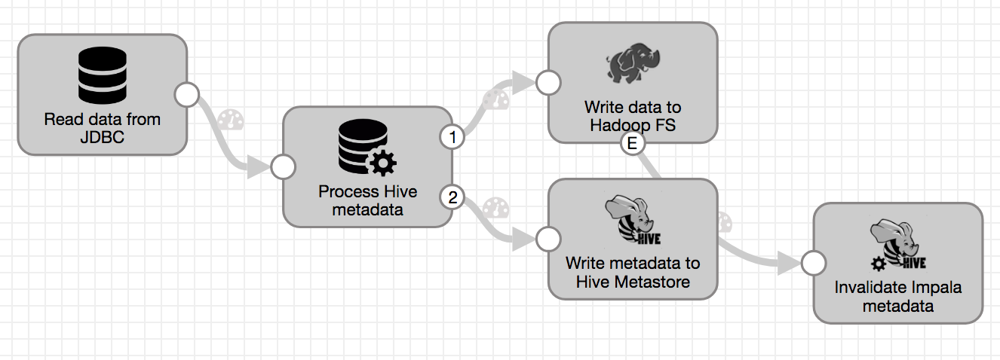
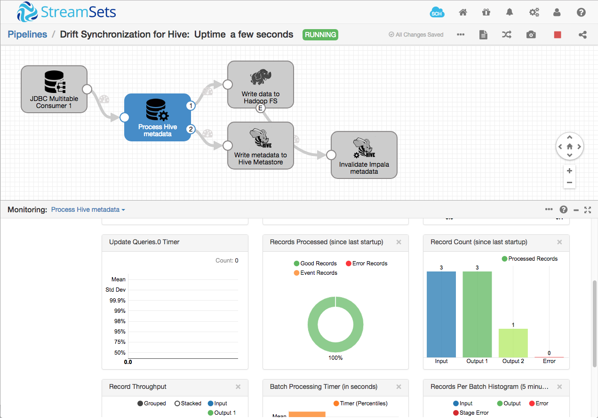

Drift Synchronization for Hive
==============================

This pipeline implements Drift Synchronization from MySQL to the Cloudera distribution of Apache Hive and Apache Impala. It's based on the [Ingesting Drifting Data into Hive and Impala](https://github.com/streamsets/tutorials/tree/master/tutorial-hivedrift) tutorial, extended to include a Hive Executor, and using the JDBC Multitable Consumer rather than the JDBC Query Consumer.

For more information, see [Drift Synchronization Solution for Hive](https://streamsets.com/documentation/datacollector/latest/help/datacollector/UserGuide/Hive_Drift_Solution/HiveDriftSolution_title.html#concept_fjj_zcf_2w) in the [StreamSets Data Collector documentation](https://streamsets.com/documentation/datacollector/latest/help/).

Prerequisites
-------------

* [StreamSets Data Collector](https://streamsets.com/products/dataops-platform/data-collector/) 3.15.0 or higher. You can [run Data Collector on your cloud provider of choice](https://streamsets.com/products/cloud/), or [download it for local use](https://streamsets.com/products/dataops-platform/data-collector/download/).
* StreamSets Data Collector CDH Stage Library
* StreamSets Data Collector JDBC Stage Library
* [Cloudera Enterprise or CDH](https://www.cloudera.com/downloads.html) - the [CDH Quickstart VM](http://www.cloudera.com/content/support/en/downloads/quickstart_vms.html) is a good place to start if you do not already have a Cloudera deployment.
* [Impala JDBC Connector for Cloudera Enterprise](https://www.cloudera.com/downloads/connectors/impala/jdbc/2-6-15.html)
* [MySQL Server](https://www.mysql.com/)
* [MySQL Connector/J](https://dev.mysql.com/downloads/connector/j/) JDBC Driver

Ensure that you are using the correct stage library for your version of CDH. See the [documentation for instructions in installing Data Collector stage libraries](https://streamsets.com/documentation/datacollector/latest/help/datacollector/UserGuide/Installation/AddtionalStageLibs.html#concept_fb2_qmn_bz).

Ensure that you use the matching Connector/J for your MySQL server. We have seen issues using the version 8.0.x JDBC Driver with MySQL Server 5.x.

Setup
-----

* Ensure you have installed all of the prerequisite components listed above.
* [Download the pipeline](Drift%20Synchronization%20for%20Hive.json) and import it into Data Collector or Control Hub.
* If you see a 'Could not find stage definition' error on one or more stages, ensure you have installed the required stage libraries (listed above), then click each affected stage and choose the appropriate stage library from the 'Change Stage Library' dropdown:
  
* Configure the pipeline parameters:
  * `JDBC_URI` - JDBC Connection String for MySQL, e.g. `jdbc:mysql://localhost:3306/shipping`
  * `JDBC_USERNAME` - Username for MySQL
  * `JDBC_PASSWORD` - Password for MySQL
  * `JDBC_DRIVER_CLASS` - JDBC Driver Class for MySQL. For the 8.0.x driver, this is `com.mysql.cj.jdbc.Driver`; for the 5.x driver, it is `com.mysql.jdbc.Driver`
  * `HADOOP_CONF_DIR` - directory with Hadoop config files. This can be an absolute path, for example, `/etc/hadoop/conf`, or a directory relative to `${SDC_RESOURCES}`, for example, `hadoop_conf`. It must contain the files `core-site.xml`, `hdfs-site.xml` and `hive-site.xml`.
  * `HIVE_JDBC_URI` - JDBC Connection String for Hive, e.g. `jdbc:hive2://quickstart.cloudera:10000/default`
  * `HIVE_JDBC_DRIVER_CLASS` - JDBC Driver Class for Hive, e.g. `org.apache.hive.jdbc.HiveDriver`
  * `IMPALA_JDBC_URI` - JDBC Connection String for Impala, e.g. `jdbc:impala://quickstart.cloudera:21050/default`
  * `IMPALA_JDBC_DRIVER_CLASS` - JDBC Driver Class for Impala, e.g. `com.cloudera.impala.jdbc41.Driver`
* Ensure that the tables in your MySQL database have primary keys, or configure appropriate [table configurations](https://streamsets.com/documentation/datacollector/latest/help/datacollector/UserGuide/Origins/MultiTableJDBCConsumer.html#concept_rx3_3hx_4y) for them.

Running the Pipeline
--------------------

You should see records ingested from MySQL and sent to Hadoop FS, with metadata being sent to Hive. Clicking on the Hive Metadata processor shows the records flowing to the two destinations - see the record count histogram in the lower pane:

The Hadoop FS destination is configured to close the output file 5 seconds after the last record is written, at which point the Hive Query executor will send an `invalidate metadata` command to Impala. You should then be able to use `impala-shell` or the Hue UI to see the data.

Here is the `shipping_events` data from the tutorial as it appears in `impala-shell`:

	[quickstart.cloudera:21000] > describe shipping_events;
	Query: describe shipping_events
	+------------+--------+-------------------+
	| name       | type   | comment           |
	+------------+--------+-------------------+
	| event_id   | int    | from deserializer |
	| order_id   | int    | from deserializer |
	| event_time | string | from deserializer |
	| event_type | string | from deserializer |
	+------------+--------+-------------------+
	Fetched 4 row(s) in 1.58s
	[quickstart.cloudera:21000] > select * from shipping_events;
	Query: select * from shipping_events
	Query submitted at: 2018-08-29 20:16:47 (Coordinator: http://quickstart.cloudera:25000)
	Query progress can be monitored at: http://quickstart.cloudera:25000/query_plan?query_id=df4eb123718e4f60:9e34161b00000000
	+----------+----------+---------------------+------------+
	| event_id | order_id | event_time          | event_type |
	+----------+----------+---------------------+------------+
	| 1        | 123      | 2016-08-21 11:23:45 | SHIPPED    |
	| 2        | 234      | 2016-08-22 12:34:56 | ARRIVED    |
	| 3        | 345      | 2016-08-23 13:45:12 | READY      |
	+----------+----------+---------------------+------------+
	Fetched 3 row(s) in 0.16s

You can insert new rows in the database, and they will be propagated to Hive. For example, adding more rows to the `shipping_events` table in MySQL:

	INSERT INTO shipping_events (order_id, event_time, event_type) 
		VALUES (123, '2016-08-24 18:23:45', 'ARRIVED');
	INSERT INTO shipping_events (order_id, event_time, event_type) 
		VALUES (345, '2016-08-25 19:34:56', 'SHIPPED');
	INSERT INTO shipping_events (order_id, event_time, event_type) 
		VALUES (456, '2016-08-26 20:45:12', 'READY');

Then a few seconds later, in `impala-shell`:

	[quickstart.cloudera:21000] > select * from shipping_events order by event_id;
	Query: select * from shipping_events order by event_id
	Query submitted at: 2018-08-29 20:18:41 (Coordinator: http://quickstart.cloudera:25000)
	Query progress can be monitored at: http://quickstart.cloudera:25000/query_plan?query_id=6c42e37e38e5658d:bf531bee00000000
	+----------+----------+---------------------+------------+
	| event_id | order_id | event_time          | event_type |
	+----------+----------+---------------------+------------+
	| 1        | 123      | 2016-08-21 11:23:45 | SHIPPED    |
	| 2        | 234      | 2016-08-22 12:34:56 | ARRIVED    |
	| 3        | 345      | 2016-08-23 13:45:12 | READY      |
	| 4        | 123      | 2016-08-24 11:23:45 | ARRIVED    |
	| 5        | 345      | 2016-08-25 12:34:56 | SHIPPED    |
	| 6        | 456      | 2016-08-26 13:45:12 | READY      |
	+----------+----------+---------------------+------------+
	Fetched 6 row(s) in 0.79s

Adding new columns then adding more new rows will cause the Hive Metadata processor to alter the Hive schema, adding the corresponding new columns to the `shipping_events` table in Hive. Again, in MySQL:

	ALTER TABLE shipping_events ADD COLUMN latitude DECIMAL(8,6), ADD COLUMN longitude DECIMAL(9,6);

Note that no changes are picked up by the pipeline or reflected in Hive until records are read with the new schema. Add some more new rows:

	INSERT INTO shipping_events (order_id, event_time, event_type, latitude, longitude) 
		VALUES (345, '2016-08-27 21:12:23', 'ARRIVED', 37.787763, -122.388264);
	INSERT INTO shipping_events (order_id, event_time, event_type, latitude, longitude) 
		VALUES (456, '2016-08-28 22:23:34', 'SHIPPED', 37.417254, -122.145144);
	INSERT INTO shipping_events (order_id, event_time, event_type, latitude, longitude) 
		VALUES (567, '2016-08-29 23:34:45', 'READY', 37.418700, -121.944967);

You will see more records being processed by the pipeline, and a new schema in Hive:

	[quickstart.cloudera:21000] > describe shipping_events;
	Query: describe shipping_events
	+------------+--------------+-------------------+
	| name       | type         | comment           |
	+------------+--------------+-------------------+
	| event_id   | int          | from deserializer |
	| order_id   | int          | from deserializer |
	| event_time | string       | from deserializer |
	| event_type | string       | from deserializer |
	| latitude   | decimal(8,6) | from deserializer |
	| longitude  | decimal(9,6) | from deserializer |
	+------------+--------------+-------------------+
	Fetched 6 row(s) in 0.10s
	[quickstart.cloudera:21000] > select * from shipping_events order by event_id;
	Query: select * from shipping_events order by event_id
	Query submitted at: 2018-08-29 20:41:45 (Coordinator: http://quickstart.cloudera:25000)
	Query progress can be monitored at: http://quickstart.cloudera:25000/query_plan?query_id=3b4fe79328a47e02:b408d28100000000
	+----------+----------+---------------------+------------+-----------+-------------+
	| event_id | order_id | event_time          | event_type | latitude  | longitude   |
	+----------+----------+---------------------+------------+-----------+-------------+
	| 1        | 123      | 2016-08-21 11:23:45 | SHIPPED    | NULL      | NULL        |
	| 2        | 234      | 2016-08-22 12:34:56 | ARRIVED    | NULL      | NULL        |
	| 3        | 345      | 2016-08-23 13:45:12 | READY      | NULL      | NULL        |
	| 4        | 123      | 2016-08-24 11:23:45 | ARRIVED    | NULL      | NULL        |
	| 5        | 345      | 2016-08-25 12:34:56 | SHIPPED    | NULL      | NULL        |
	| 6        | 456      | 2016-08-26 13:45:12 | READY      | NULL      | NULL        |
	| 7        | 345      | 2016-08-27 14:12:23 | ARRIVED    | 37.787763 | -122.388264 |
	| 8        | 456      | 2016-08-28 15:23:34 | SHIPPED    | 37.417254 | -122.145144 |
	| 9        | 567      | 2016-08-29 16:34:45 | READY      | 37.418700 | -121.944967 |
	+----------+----------+---------------------+------------+-----------+-------------+
	Fetched 9 row(s) in 0.24s

Notes
-----

* If you have any issues when previewing the pipeline, increase the preview timeout and try again. It can take a few seconds for the Hive Metadata processor to retrieve the existing schema from Hive and reconcile it with the incoming record structure.