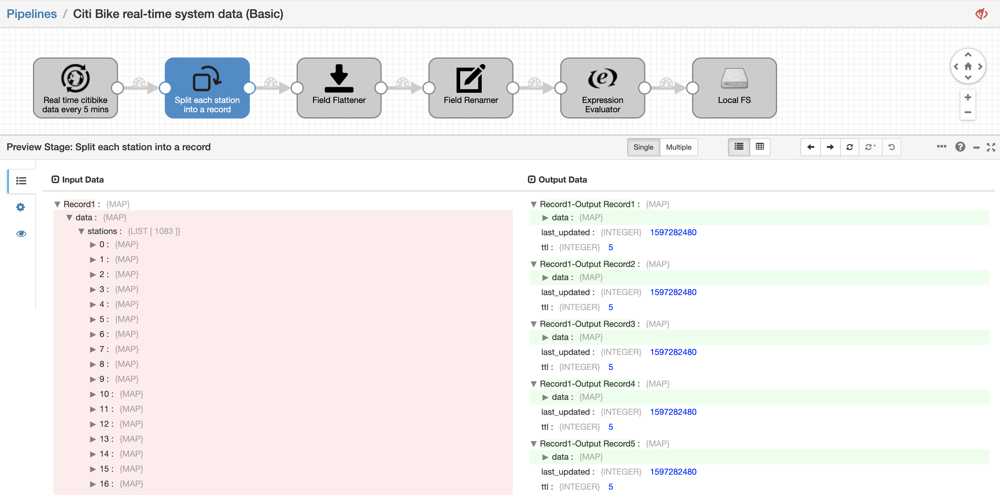
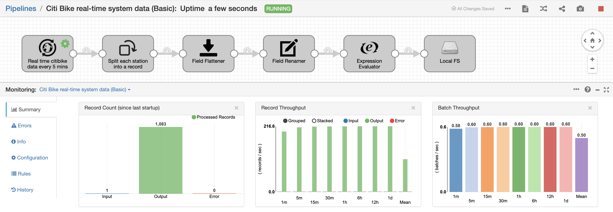

<h1>
Citi Bike real-time system data (Basic)
</h1>

**Important:** *These instructions assume you have access to StreamSets Data Collector (v3.16+) and have performed all the prerequisites*

- For help installing [StreamSets Data Collector](https://streamsets.com/products/dataops-platform/data-collector/), see [StreamSets Data Collector Installation](https://streamsets.com/documentation/datacollector/latest/help/datacollector/UserGuide/Installation/Install_title.html).

## OVERVIEW

This pipeline demonstrates how to:
- Read from Rest APIs to get ‘real time’ data
- Work easily with unstructured and hierarchical data
- Easily convert hierarchical data into rows for relational stores

## PIPELINE

")

## DOCUMENTATION

[HTTP Client Origin](https://streamsets.com/documentation/datacollector/latest/help/datacollector/UserGuide/Origins/HTTPClient.html)

## STEP-BY-STEP

### Step 1: Download the pipeline

[Click Here](./Citi_Bike_real_time_system_data.zip?raw=true) to download the pipeline and save it to your drive.

### Step 2: Import the pipeline

Click the down arrow next to the "Create New Pipeline" and select "Import Pipeline".

Click "Browse" and locate the pipeline file you just downloaded, then click "Import"

### Step 3: Preview the pipeline

Click on the pipeline you just imported to open it and select the Preview icon

Leave all default options in the preview configuration and click "Run Preview"

While in the Preview, click on each processor to see how data is being parsed.
Close the Preview to be able to run the pipeline

### Step 4: Run the pipeline

Start the pipeline

