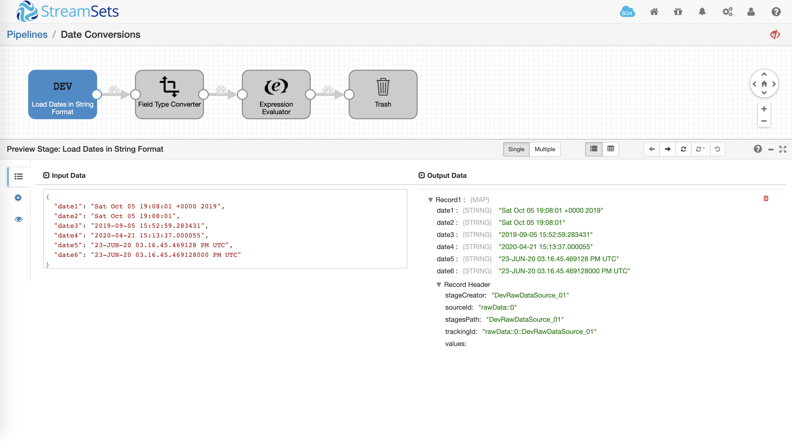
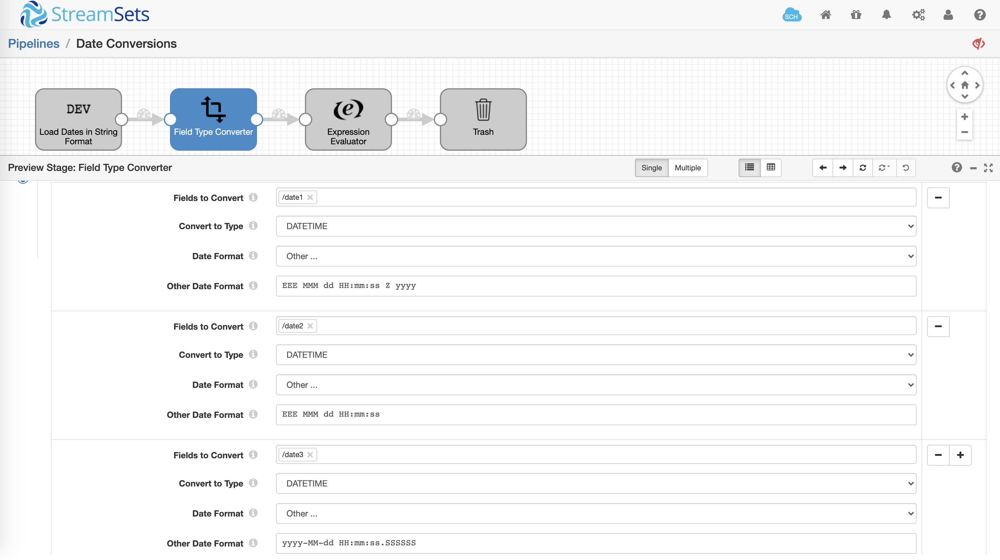
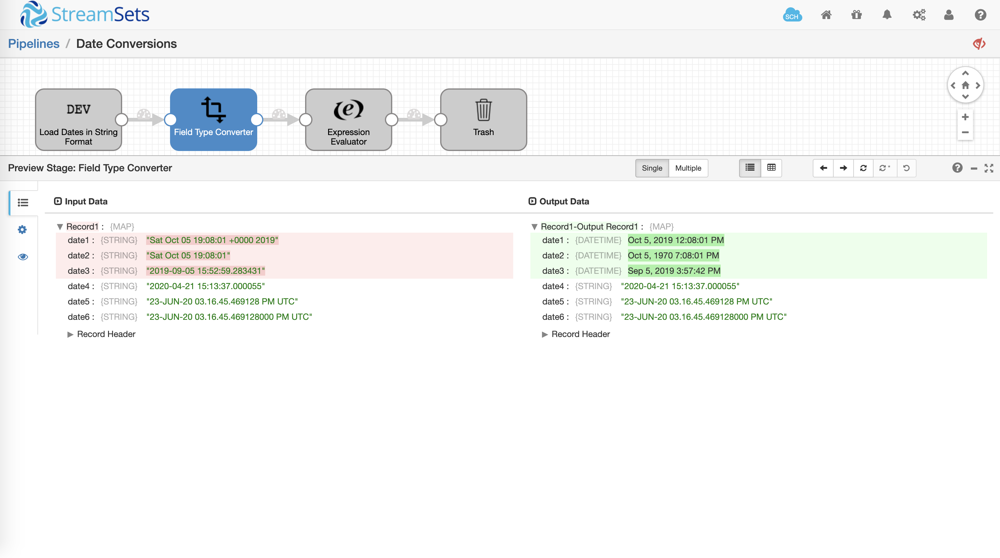
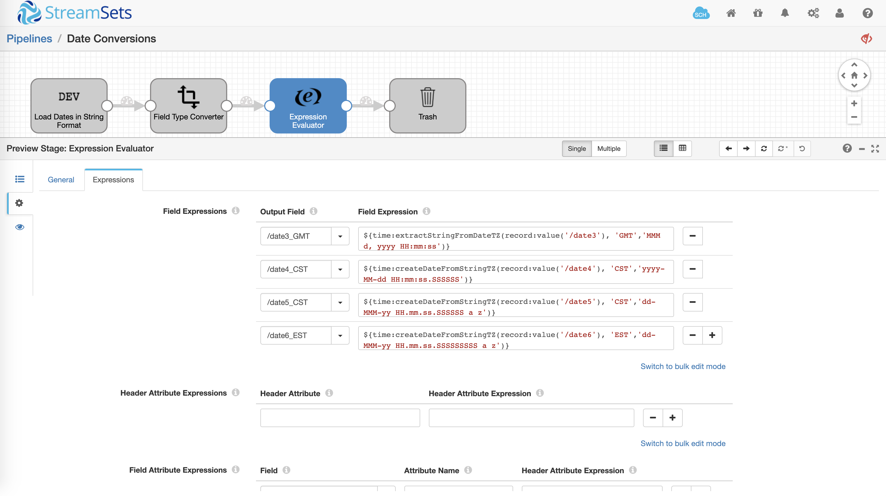
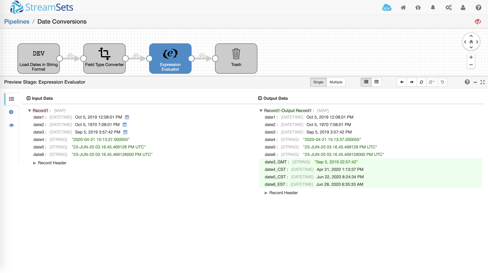

Date Conversions
================

This pipeline demonstrates how to convert dates from string to various datetime formats and timezones using Field Type Converter and Expression Evaluator processors.

Setup And Technical Details
---------------------------

* Download the [pipeline](DateConvef79157e5-c817-423a-a072-0c01e5d01745.json) and import it into your Data Collector

Pipeline Overview
----------------

The pipeline has been prepopulated with sample dates in string format.

Click on **Preview** icon to see how the data is being transformed as it is flowing through various stages in the pipeline. For details on data preview, refer to the [documentation](https://streamsets.com/documentation/datacollector/latest/help/datacollector/UserGuide/Data_Preview/DataPreview_Title.html#concept_jjk_23z_sq).

**Field Type Converter**

Using [Field Type Converter](https://streamsets.com/documentation/datacollector/latest/help/datacollector/UserGuide/Processors/FieldTypeConverter.html#concept_is3_zkp_wq) dates in columns *date1*, *date2*, and *date3* are converted to datetime using formats *EEE MMM dd HH:mm:ss Z yyyy*, *EEE MMM dd HH:mm:ss*, and *yyyy-MM-dd HH:mm:ss.SSSSSS* respectively.

**Expression Evaluator**

Using [Expression Evaluator](https://streamsets.com/documentation/datacollector/latest/help/datacollector/UserGuide/Processors/Expression.html#concept_zm2_pp3_wq) dates in columns *date3*, *date4*, *date5* and *date6* are converted to datetime in various timezones using expressions *${time:extractStringFromDateTZ(record:value('/date3'), 'GMT','MMM d, yyyy HH:mm:ss')}*, *${time:createDateFromStringTZ(record:value('/date4'), 'CST','yyyy-MM-dd HH:mm:ss.SSSSSS')}*, *${time:createDateFromStringTZ(record:value('/date5'), 'CST','dd-MMM-yy HH.mm.ss.SSSSSS a z')}*, and *${time:createDateFromStringTZ(record:value('/date6'), 'EST','dd-MMM-yy HH.mm.ss.SSSSSSSSS a z')}* respectively.

