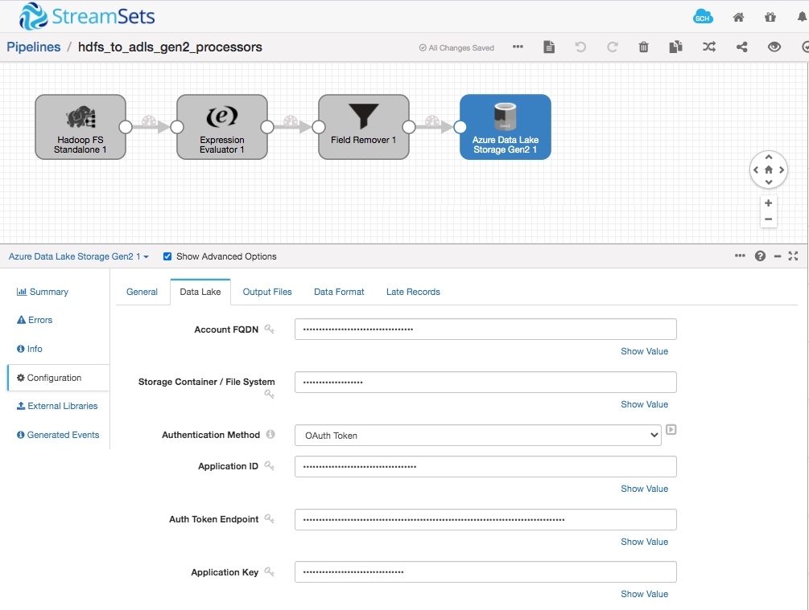

How to migrate to a Cloud Data Lake in Hours!!
==============================================

This StreamSets Data Collector pipeline is designed to load data from HDFS to ADLS Gen 2.

Prerequisites
---------------------

* StreamSets Data Collector [installed, up and running](https://streamsets.com/getting-started/download-install-data-collector/)
* Hadoop FS installed and accessible from above SDC (StreamSets Data Collector). More details are available in [documentation](https://streamsets.com/documentation/datacollector/latest/help/datacollector/UserGuide/Origins/HDFSStandalone.html#concept_djz_pdm_hdb).
* Microsoft Azure account. At the time of writing, you can [create a free Azure account](https://azure.microsoft.com/en-us/free/). Configure it according to [documentation](https://streamsets.com/documentation/datacollector/latest/help/datacollector/UserGuide/Destinations/ADLS-G2-D.html#concept_vvn_21l_vhb) (One sample way is this [ADLS destination tutorial](https://github.com/streamsets/tutorials/tree/master/tutorial-adls-destination)).

Setup
---------------------

* [Download and import the pipeline](hdfs_to_adls_gen2_processors.json) into your instance of Data Collector
* [Download the sample dataset](dataset)

* After importing the pipeline into your environment and before running the pipeline, enter the following data lake configurations.
:

Also, take a look into Hadoop FS Destination stage configuration to see if you need to make any changes. 

Technical Details
------------------------------

For technical information and detailed explanation of this use case, read this [blog](https://streamsets.com/blog/how-to-migrate-to-a-cloud-data-lake-in-hours/).
