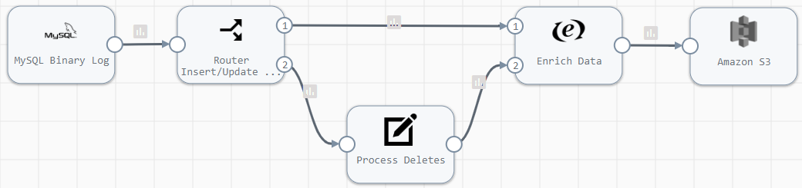
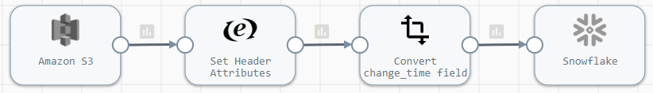
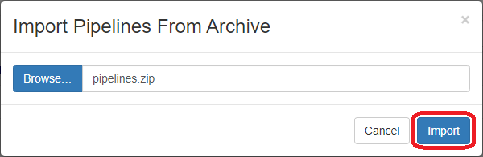
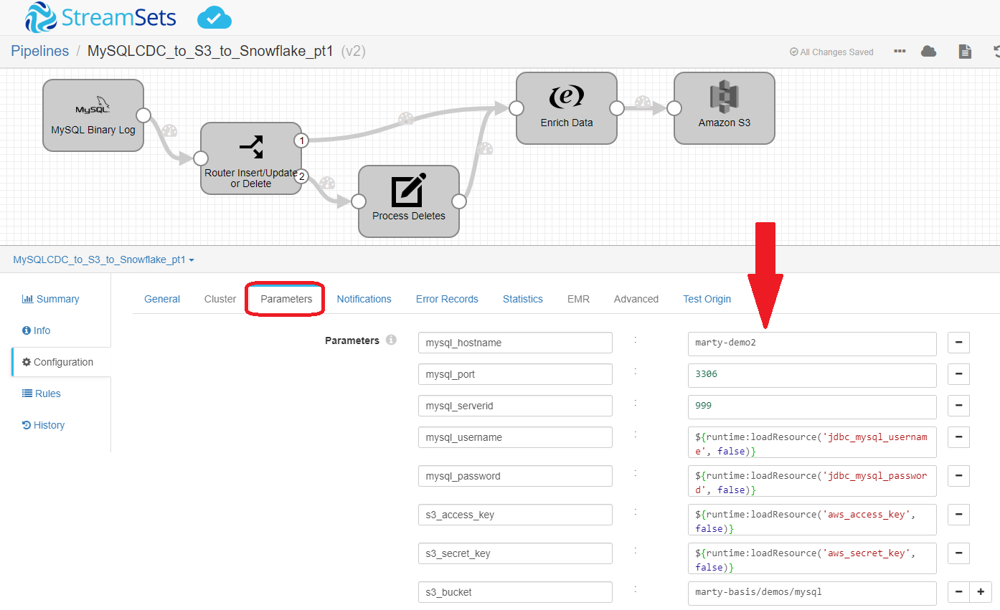
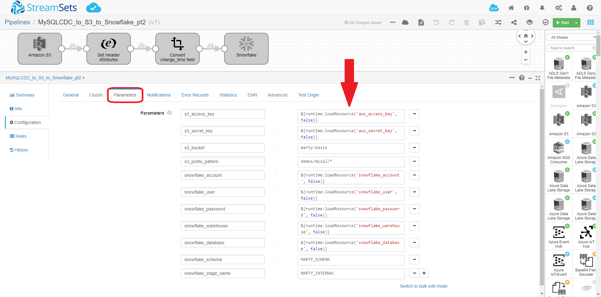
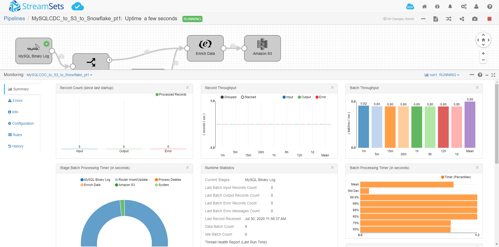
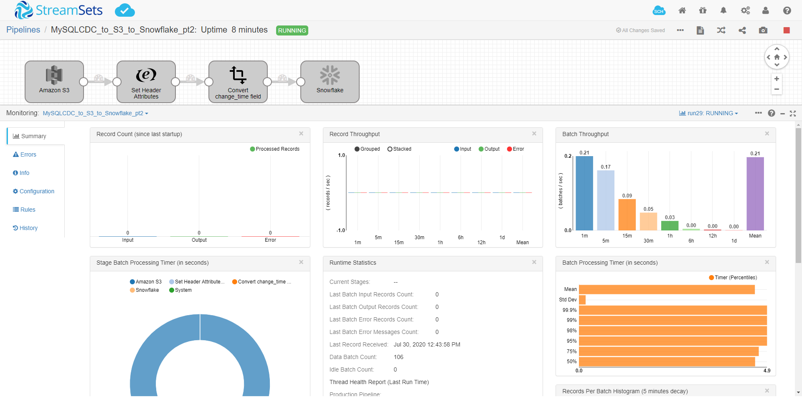
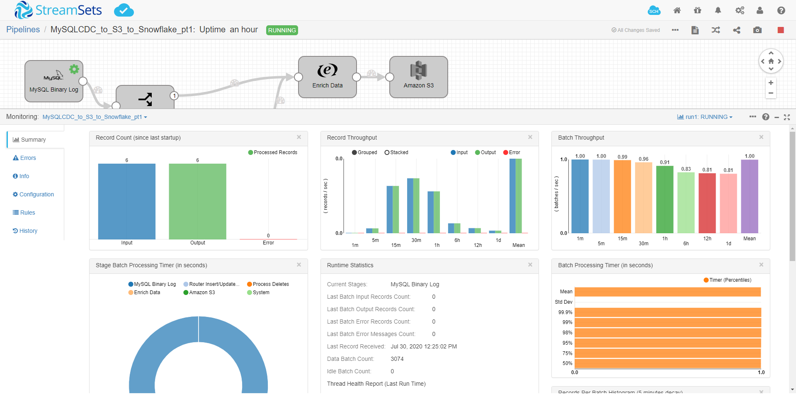
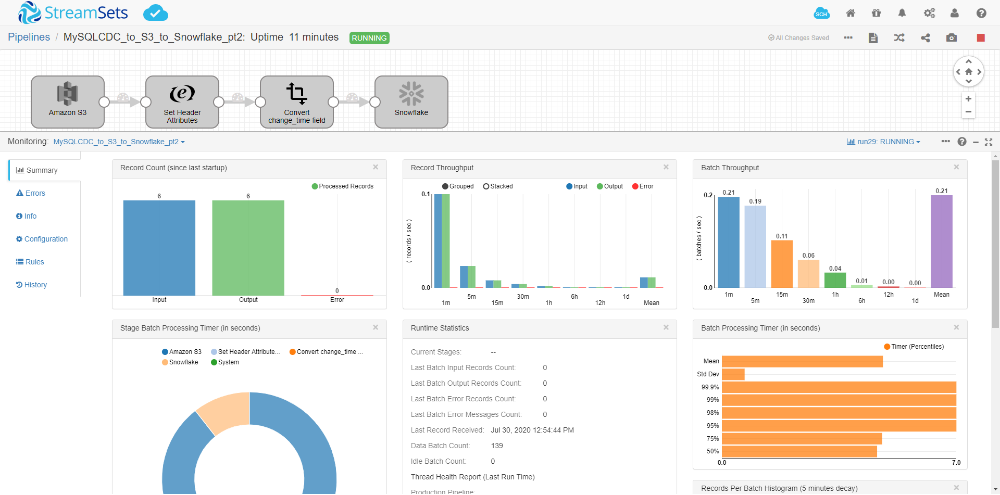

<h1>
MySQL CDC to S3 to Snowflake
</h1>

# MySQL CDC to S3 to Snowflake

**Important:** *These instructions assume you have access to StreamSets Data Collector (v3.15+) and have performed all the prerequisites for MySQL ,S3 and Snowflake*

- For help installing [StreamSets Data Collector](https://streamsets.com/products/dataops-platform/data-collector/), see [StreamSets Data Collector Installation](https://streamsets.com/documentation/datacollector/latest/help/datacollector/UserGuide/Installation/Install_title.html).
- For help with MySQL Binary Log prerequisites, see [MySQL Binary Log](https://streamsets.com/documentation/datacollector/latest/help/datacollector/UserGuide/Origins/MySQLBinaryLog.html).
- For help with Snowflake prerequisites, see [Snowflake](https://streamsets.com/documentation/datacollector/latest/help/datacollector/UserGuide/Destinations/Snowflake.html).

Here is a link to a short video on using this pipeline template: [Video Link](https://www.youtube.com/channel/UC_4K-__dngOCEmoZs7PVZAg)

## OVERVIEW

Many customers want to stage changed data to an intermediate storage such as S3 or Kafka before propogating them to their destination.  These pipelines demonstrate how to read change data capture (CDC) data from a MySQL database and write those changes to S3 and then replicate the changes to Snowflake.  In order to do that properly, you need to set the *sdc.operation.type* header attribute to the type of record (Insert/Delete/Update).  There are two (2) pipelines used to accomplish this: 1) reads the changed data and writes to S3 and 2) reads from S3 and writes to Snowflake.

**Disclaimer:** *This pipeline is meant to serve as a template for performing MySQL binlog CDC to S3 to Snowflake.  Some of the parameters, tables and fields may be different for your environment and may need additional customizations.  You may need to change the default regions for S3 and Snowflake.  Please consult the StreamSets documentation (linked below) for full information on configuration of each stage used below.*

## USING THE TEMPLATE

NOTE: [Templates](https://streamsets.com/documentation/controlhub/latest/onpremhelp/controlhub/UserGuide/Pipelines/PipelineTemplates.html) are supported in [StreamSets Control Hub](https://streamsets.com/products/dataops-platform/control-hub/). If you do not have Control Hub, you can import the template pipeline in Data Collector but will need to do that each time you want to use the template.

## PIPELINE #1 - MySQL CDC to S3

### Pipeline Description

Stage | Description
--- | ---
`MySQL Binary Log` | Reads changed data from MySQL Binary Log
`Router Insert/Update or Delete` | Routes the data based on if it is an Insert/Update or a Delete
`Process Deletes` | If the record is a delete, we need to move /OldData to /Data
`Enrich Data` | Enriches data with change_operation and change_time
`Amazon S3` | Writes data to Amazon S3 in JSON format - **Verify the Region is correct**

## DOCUMENTATION

[MySQL Binlog Origin](https://streamsets.com/documentation/datacollector/latest/help/datacollector/UserGuide/Origins/MySQLBinaryLog.html)

[StreamSelector](https://streamsets.com/documentation/datacollector/latest/help/datacollector/UserGuide/Processors/StreamSelector.html)

[Field Renamer](https://streamsets.com/documentation/datacollector/latest/help/datacollector/UserGuide/Processors/FieldRenamer.html)

[Amazon S3](https://streamsets.com/documentation/datacollector/latest/help/datacollector/UserGuide/Destinations/AmazonS3.html)

## PIPELINE #2 - S3 to Snowflake

### Pipeline Description

Stage | Description
--- | ---
`Amazon S3` | Reads data files created in first pipeline from S3 - **Verify the Region is correct** 
`Set Header Sttributes` | Sets the table name and sdc.operation.type in the header attribute
`Convert change_time field` | Converts the change_time field to DATETIME field type
`Amazon S3` | Writes data to Amazon S3 in JSON format - **Verify the Region is correct**

## DOCUMENTATION

[Amazon S3](https://streamsets.com/documentation/datacollector/latest/help/datacollector/UserGuide/Origins/AmazonS3.html)

[Expression Evaluator](https://streamsets.com/documentation/datacollector/latest/help/datacollector/UserGuide/Processors/Expression.html)

[Field Type Converter](https://streamsets.com/documentation/datacollector/latest/help/datacollector/UserGuide/Processors/FieldTypeConverter.html)

[Snowflake](https://streamsets.com/documentation/datacollector/latest/help/datacollector/UserGuide/Destinations/Snowflake.html)

## STEP-BY-STEP

### Step 1: Download the pipelines

[Click Here](./pipelines.zip?raw=true) to download the pipeline and save it to your drive.

### Step 2: Import the pipeline

Click the down arrow next to the "Create New Pipeline" and select "Import Pipeline From Archive".

Click "Browse" and locate the pipeline file you just downloaded, click "OK", then click "Import"

### Step 3: Configure the parameters for pipeline #1

Click on the pipeline **MySQLCDC_to_S3_to_Snowflake_pt1** to open it and click on the "Parameters" tab and fill in the appropriate information for your environment.

**Important:** *The pipeline template uses the most common default settings for things like the Snowflake region, staging location, etc. All of these are configurable and if you need to change those, you can opt to not use the built-in parameters and choose the appropriate settings yourself. Please refer to the documentation listed in this document for all the available options.*

The following parameters are set up for this pipeline:

<table>
  <tr>
   <td><code>mysql_hostname</code>
   </td>
   <td class="entry cellrowborder" headers="d436212e756 ">MySQL server hostname.</td>
  </tr>
  <tr>
   <td><code>mysql_port</code>
   </td>
   <td class="entry cellrowborder" headers="d436212e756 ">MySQL server port. </td>
  </tr>
  <tr>
   <td><code>mysql_serverid</code>
   </td>
   <td class="entry cellrowborder" headers="d436212e756 ">Replication server ID that the origin uses to connect to
                                        the master MySQL server. Must be unique from the server ID
                                        of the replication master and of all the other replication
                                            slaves.
When the MySQL server database is enabled for
                                            GTID, the server ID is optional. 

</td>
  </tr>
  <tr>
   <td><code>mysql_username</code>
   </td>
   <td class="entry cellrowborder" headers="d436212e853 ">MySQL username. 
The user must have the following MySQL
                                                privileges:<ul>
                                                <li>REPLICATION CLIENT</li>
                                                <li>REPLICATION SLAVE</li>
                                            </ul>

</td>
  </tr>
  <tr>
   <td><code>mysql_password</code>
   </td>
   <td class="entry cellrowborder" headers="d436212e853 ">MySQL password.
Tip: To secure sensitive information such as user names and passwords, you can use <a class="xref" href="https://streamsets.com/documentation/datacollector/latest/help/index.html?contextID=concept_bs4_5nm_2s" title="Similar to runtime properties, runtime resources are values that you define in a file local to the Data Collector and call from within a pipeline. But with runtime resources, you can restrict the permissions for the files to secure information.">runtime resources</a> or <a class="xref" href="https://streamsets.com/documentation/datacollector/latest/help/index.html?contextID=concept_bt1_bpj_r1b">credential stores.</a>

</td>
  </tr>
  <tr>
   <td><code>s3_access_key</code>
   </td>
   <td class="entry cellrowborder" headers="d87689e1418 ">
                
AWS access key ID.

                
Required when not using IAM roles with IAM instance profile credentials.

              </td>
  </tr>
  <tr>
   <td><code>s3_secret_key</code>
   </td>
   <td class="entry cellrowborder" headers="d87689e1418 ">
                
AWS secret access key. 

                
Required when not using IAM roles with IAM instance profile credentials. 

              </td>
  </tr>
  <tr>
   <td><code>s3_bucket</code>
   </td>
   <td class="entry cellrowborder" headers="d87689e1418 ">Bucket to use when writing records.
Enter a bucket name or define an
                  expression that evaluates to bucket names. 

When using datetime variables in
                  the expression, be sure to configure the time basis for the stage.

</td>
  </tr>
</table>

### Step 4: Configure the parameters for pipeline #2

Click on the pipeline **MySQLCDC_to_S3_to_Snowflake_pt2** to open it and click on the "Parameters" tab and fill in the appropriate information for your environment.

**Important:** *The pipeline template uses the most common default settings for things like the  region, staging location, etc. All of these are configurable and if you need to change those, you can opt to not use the built-in parameters and choose the appropriate settings yourself. Please refer to the documentation listed in this document for all the available options.*

The following parameters are set up for this pipeline:

<table>
  <tr>
   <td><code>s3_access_key</code>
   </td>
   <td class="entry cellrowborder" headers="d314770e1756 ">
                
AWS access key ID.

                
Required when not using IAM roles with IAM instance profile credentials.

              </td>
  </tr>
  <tr>
   <td><code>s3_secret_key</code>
   </td>
  <td class="entry cellrowborder" headers="d314770e1756 ">
                
AWS secret access key. 

                
Required when not using IAM roles with IAM instance profile credentials. 

              </td>
  </tr>
  <tr>
   <td><code>s3_bucket</code>
   </td>
                                    <td class="entry cellrowborder" headers="d314770e1756 ">Bucket that contains the objects to be read.
Note: The bucket name must be DNS compliant. For more
                  information about bucket naming conventions, see the <a class="xref" href="https://docs.aws.amazon.com/AmazonS3/latest/dev/BucketRestrictions.html" target="_blank">Amazon S3 documentation</a>.

</td>
  </tr>
  <tr>
   <td><code>s3_prefix_pattern</code>
   </td>
   <td class="entry cellrowborder" id="task_gfj_ssv_yq__d29e1473" headers="d314770e1756 ">Prefix pattern that describes the objects to be
                processed. 
You can include the entire path to the objects. You can also use
                  Ant-style path patterns to read objects recursively. 

</td>
  </tr>
  <tr>
   <td><code>snowflake_account</code>
   </td>
   <td class="entry cellrowborder" headers="d198512e2230 ">Snowflake account name.</td>
  </tr>
  <tr>
   <td><code>snowflake_user</code>
   </td>
   <td class="entry cellrowborder" headers="d198512e2230 ">Snowflake user name.</td>
  </tr>
  <tr>
   <td><code>snowflake_password</code>
   </td>
   <td class="entry cellrowborder" headers="d198512e2230 ">Snowflake password.</td>
  </tr>
  <tr>
   <td><code>snowflake_warehouse</code>
   </td>
   <td class="entry cellrowborder" headers="d198512e2372 ">Snowflake warehouse.</td>
  </tr>
  <tr>
   <td><code>snowflake_database</code>
   </td>
   <td class="entry cellrowborder" headers="d198512e2372 ">Snowflake database.</td>
  </tr>
  <tr>
   <td><code>snowflake_schema</code>
   </td>
   <td class="entry cellrowborder" headers="d198512e2372 ">Snowflake schema.</td>
  </tr>
  <tr>
   <td><code>snowflake_stage_name</code>
   </td>
   <td class="entry cellrowborder" headers="d198512e2713 ">Name of the Snowflake stage used to stage the data.
                                            
Unless using a Snowflake internal user stage, you
                                            create this stage as part of the <a class="xref" href="https://streamsets.com/documentation/datacollector/latest/help/index.html?contextID=concept_ysy_fcj_ggb">Snowflake prerequisite tasks</a>.

To use a
                                            Snowflake internal user stage, enter a tilde
                                                (<code class="ph codeph">~</code>).

</td>
  </tr>
</table>

### Step 5: Run the pipelines

Open each pipeline and click the "START" button to run each pipeline.

### Step 6: Make changes to the MySQL source table and see the pipelines process them

