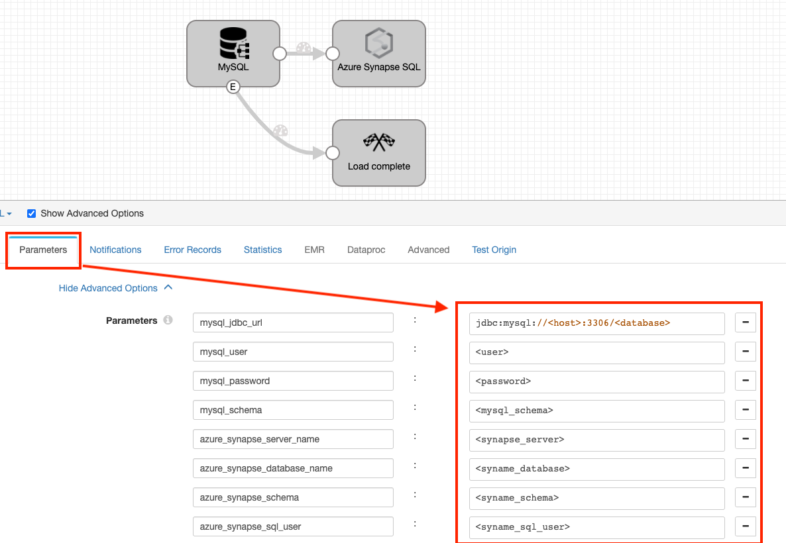
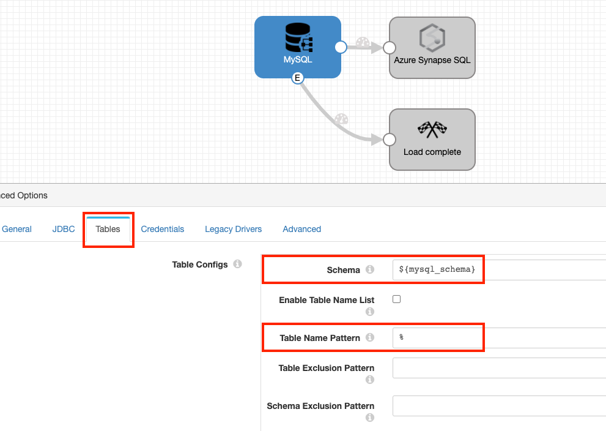
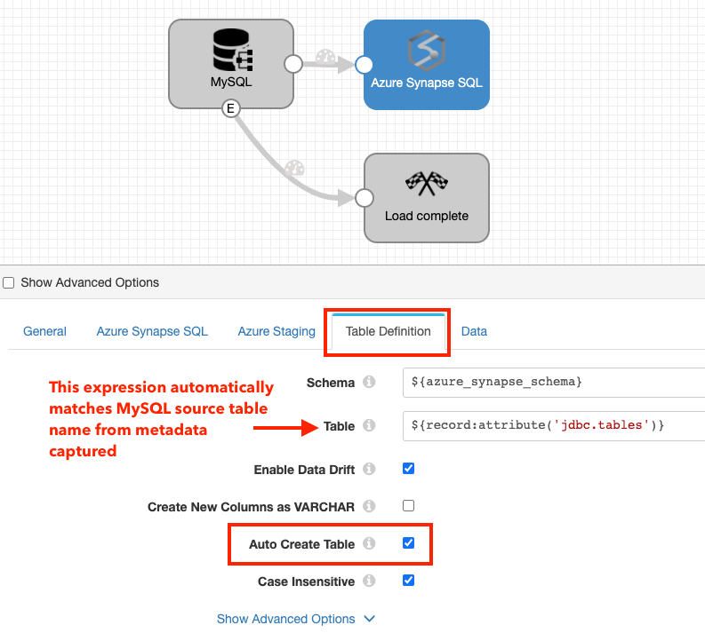
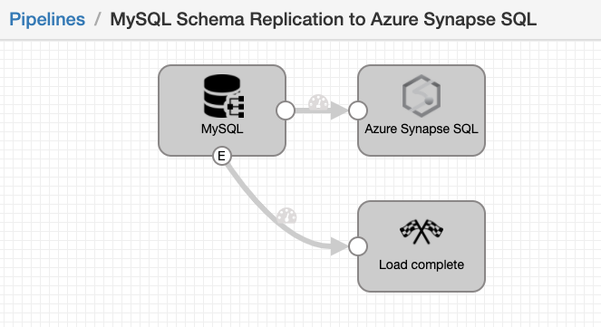

MySQL Schema replication to Azure Synapse SQL
==============================

This pipeline demonstrates how to bulk load data from MySQL into Azure Synapse SQL. You can select one or more MySQL schemas to replicate into Synapse SQL with a single Data Collector pipeline.

For more information, see [Loading Data into Azure Synapse SQL](https://streamsets.com/documentation/datacollector/latest/help/datacollector/UserGuide/Destinations/AzureSynapse.html) in [StreamSets Data Collector documentation](https://streamsets.com/documentation/datacollector/latest/help/).

Pre-requisites
-------------

* Run [StreamSets Data Collector](https://streamsets.com/products/dataops-platform/data-collector/) from Azure Marketplace or [download it for local use](https://streamsets.com/products/dataops-platform/data-collector/download/). Download version must be 3.19.0 or higher.
* Ensure the [pre-requisites](https://streamsets.com/documentation/datacollector/latest/help/datacollector/UserGuide/Destinations/AzureSynapse.html "pre-requisites") for Azure Synapse SQL are complete

Setup
-----

* [Download the pipeline](MySQL_Schema_Replication_to_Azure_Synapse_SQL.zip.zip?raw=true) and import it into Data Collector or Control Hub
* Configure all the pipeline parameters for your MySQL Database, Synapse and Azure Staging connections.

* Optionally, update the MySQL origin to read from specific schemas and/or tables

* By default, the Azure Synapse SQL destination is configured to auto create each table that is replicated from MySQL. If you'd like, update the configurations in the destination per your needs.

Running the Pipeline
--------------------

Start the pipeline. It takes a couple of seconds to create a connection to Synapse. Once the connection is established, you should see records ingested from MySQL and sent to Synapse SQL. The pipeline is also configured to automatically stop after it's ingested all the data from MySQL. If you'd like to continue running the pipeline such that it incrementally ingests as data arrives in MySQL then uncheck 'Process Events' from the origin and delete the 'Load complete' executor.

