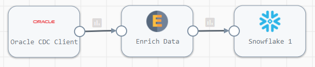
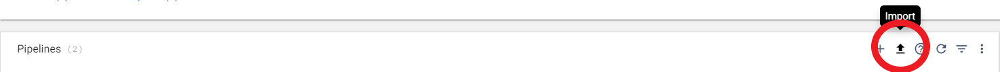
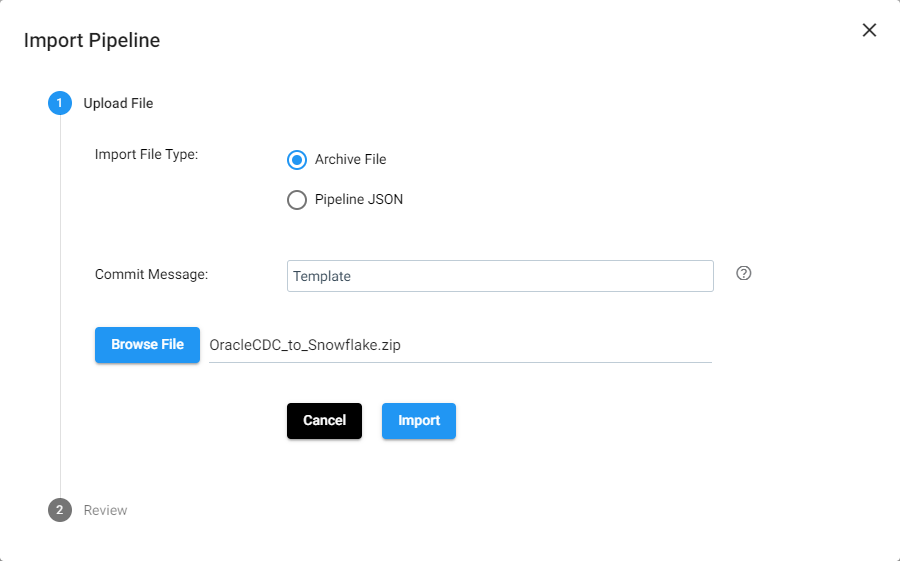
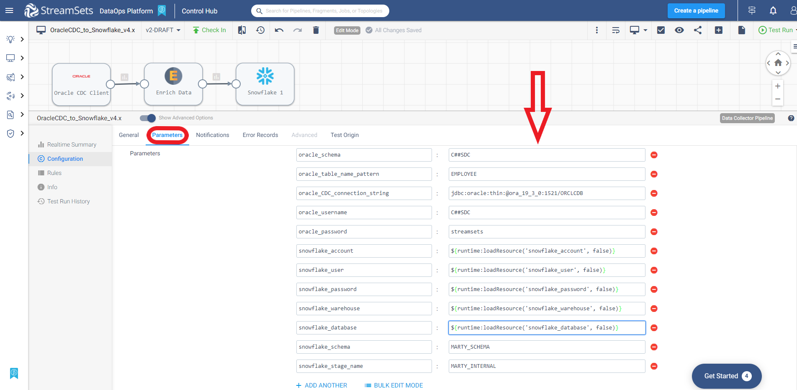
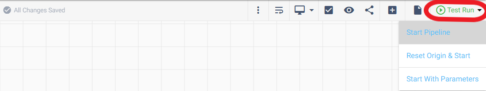
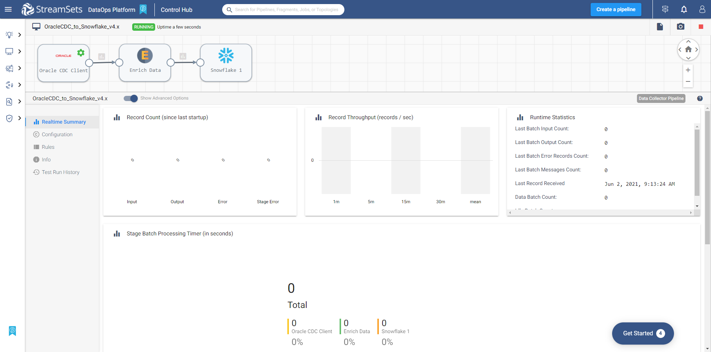
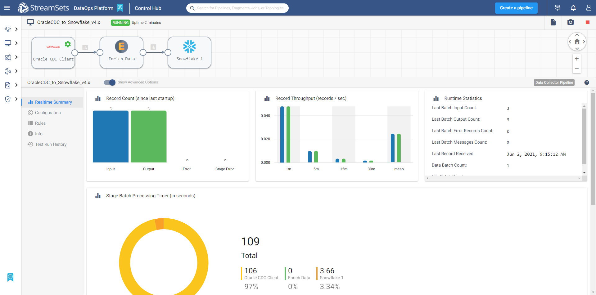

<h1>
Oracle CDC to Snowflake
</h1>

# Oracle CDC to Snowflake 4.x

**Important:** *These instructions assume you have access to StreamSets Data Collector (v4.0+) and have performed all the prerequisites for Oracle and Snowflake*

- For help installing [StreamSets Data Collector](https://streamsets.com/products/dataops-platform/data-collector/), see [StreamSets Data Collector Installation](https://streamsets.com/documentation/datacollector/latest/help/datacollector/UserGuide/Installation/Install_title.html).
- For help with Oracle CDC Client prerequisites, see [Oracle CDC Client](https://streamsets.com/documentation/datacollector/latest/help/datacollector/UserGuide/Origins/OracleCDC.html).
- For help with Snowflake prerequisites, see [Snowflake](https://streamsets.com/documentation/datacollector/latest/help/datacollector/UserGuide/Destinations/Snowflake.html).

## OVERVIEW

This pipeline demonstrates how to read change data capture (CDC) data from an Oracle database and replicate the changes to Snowflake.

**Disclaimer:** *This pipeline is meant to serve as a template for performing Oracle CDC to Snowflake.  Some of the parameters, tables and fields may be different for your environment and may need additional customizations.  Please consult the StreamSets documentation (linked below) for full information on configuration of each stage used below.*

## PIPELINE

## DOCUMENTATION

[Oracle CDC Client](https://streamsets.com/documentation/datacollector/latest/help/datacollector/UserGuide/Origins/OracleCDC.html)

[Expression Evaluator](https://streamsets.com/documentation/datacollector/latest/help/datacollector/UserGuide/Processors/Expression.html)

[Snowflake Destination](https://streamsets.com/documentation/datacollector/latest/help/datacollector/UserGuide/Destinations/Snowflake.html)

## STEP-BY-STEP

### Step 1: Download the pipeline

[Click Here](./OracleCDC_to_Snowflake_v4.x.zip?raw=true) to download the pipeline and save it to your drive.

### Step 2: Import the pipeline

Click the up arrow in the Pipelines list to start the import process.

Select 'Archive File', enter a Commit Message, then click "Browse File" and locate the pipeline file you just downloaded and select it. Click "Import"

### Step 3: Configure the parameters

Click on the pipeline you just imported to open it and click on the "Show Advanced Options" then select the "Parameters" tab and fill in the appropriate information for your environment.

**Important:** *The pipeline template uses the most common default settings for things like the Snowflake region, staging location, etc. All of these are configurable and if you need to change those, you can opt to not use the built-in parameters and choose the appropriate settings yourself. Please refer to the documentation listed in this document for all the available options.*

The following parameters are set up for this pipeline:

<table>
  <tr>
                                    <td><code>oracle_schema</code></td>
                                    <td class="entry cellrowborder" headers="d442874e2435 ">Schema to use. You can enter a schema name or use <a class="xref" href="https://docs.oracle.com/database/121/SQLRF/conditions007.htm#SQLRF00501" target="_blank">SQL LIKE syntax</a> to
                                        specify a set of schemas.
The origin submits the schema
                                            name in all caps by default. To use a lower or
                                            mixed-case name, select the Case-Sensitive Names
                                            property.

</td>
                                </tr>
  <tr>
                                    <td><code>oracle_table_name_pattern</a></td>
                                    <td class="entry cellrowborder" headers="d442874e2435 ">Table name pattern that specifies the tables to track.
                                        You can enter a table name or use <a class="xref" href="https://docs.oracle.com/database/121/SQLRF/conditions007.htm#SQLRF00501" target="_blank">SQL LIKE syntax</a> to
                                        specify a set of tables. The origin submits table names in
                                        all caps by default. To use lower or mixed-case names,
                                        select the Case-Sensitive Names property.</td>
                                </tr>
  <tr>
   <td><code>oracle_CDC_connection_string</code>
   </td>
   <td class="entry cellrowborder" headers="d442874e2818 ">Connection string used to connect to the database.
                                            
Note: If you include the JDBC credentials in the
                                            connection string, use the user account created for the
                                            origin. Common user accounts for Oracle 12c, 18c, or 19c
                                            multitenant databases start with <code class="ph codeph">c##</code>.
                                            

</td>
  </tr>
  <tr>
   <td><code>oracle_username</code>
   </td>
   <td class="entry cellrowborder" headers="d442874e2925 ">User name for the JDBC connection. Use the user account
                                        created for the origin. Common user accounts for Oracle 12c,
                                        18c, or 19c multitenant databases start with
                                            <code class="ph codeph">c##</code>.
For more information, see <a class="xref" href="https://streamsets.com/documentation/datacollector/latest/help/index.html?contextID=concept_jnz_bd2_3y">Task 3. Create a User Account</a>.

</td>
  </tr>
  <tr>
   <td><code>oracle_password</code>
   </td>
   <td class="entry cellrowborder" headers="d436212e853 ">Oracle password.
Tip: To
                        secure sensitive information such as user names and passwords, you can use
                              <a class="xref" title="Similar to runtime properties, runtime resources are values that you define in a file local to the Data Collector and call from within a pipeline. But with runtime resources, you can restrict the permissions for the files to secure information." href="https://streamsets.com/documentation/datacollector/latest/help/index.html?contextID=concept_bs4_5nm_2s">runtime resources</a> or <a class="xref" href="https://streamsets.com/documentation/datacollector/latest/help/index.html?contextID=concept_bt1_bpj_r1b">credential stores.</a>

</td>
  </tr>
  <tr>
   <td><code>snowflake_account</code>
   </td>
   <td class="entry cellrowborder" headers="d198512e2230 ">Snowflake account name.</td>
  </tr>
  <tr>
   <td><code>snowflake_user</code>
   </td>
   <td class="entry cellrowborder" headers="d198512e2230 ">Snowflake user name.</td>
  </tr>
  <tr>
   <td><code>snowflake_password</code>
   </td>
   <td class="entry cellrowborder" headers="d198512e2230 ">Snowflake password.</td>
  </tr>
  <tr>
   <td><code>snowflake_warehouse</code>
   </td>
   <td class="entry cellrowborder" headers="d198512e2372 ">Snowflake warehouse.</td>
  </tr>
  <tr>
   <td><code>snowflake_database</code>
   </td>
   <td class="entry cellrowborder" headers="d198512e2372 ">Snowflake database.</td>
  </tr>
  <tr>
   <td><code>snowflake_schema</code>
   </td>
   <td class="entry cellrowborder" headers="d198512e2372 ">Snowflake schema.</td>
  </tr>
  <tr>
   <td><code>snowflake_stage_name</code>
   </td>
   <td class="entry cellrowborder" headers="d198512e2713 ">Name of the Snowflake stage used to stage the data.
                                            
Unless using a Snowflake internal user stage, you
                                            create this stage as part of the <a class="xref" href="https://streamsets.com/documentation/datacollector/latest/help/index.html?contextID=concept_ysy_fcj_ggb">Snowflake prerequisite tasks</a>.

To use a
                                            Snowflake internal user stage, enter a tilde
                                                (<code class="ph codeph">~</code>).

</td>
  </tr>
</table>

### Step 4: Run the pipeline

Click the "Test Run" button and select "Start Pipeline" to run the pipeline.

### Step 5: Make changes to the Oracle source table and see the pipeline process them

