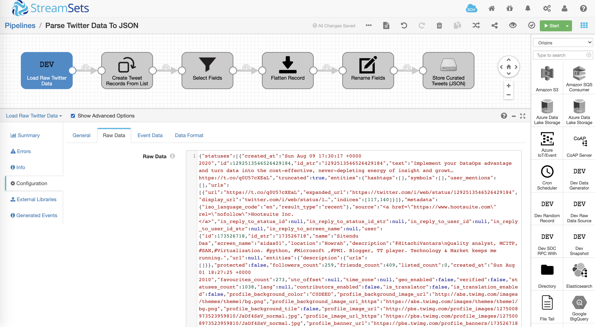
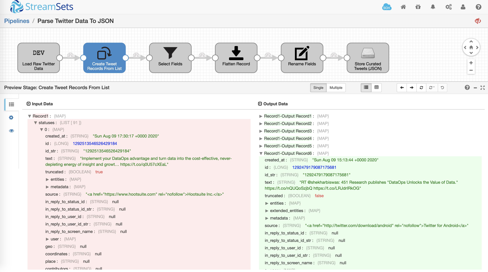
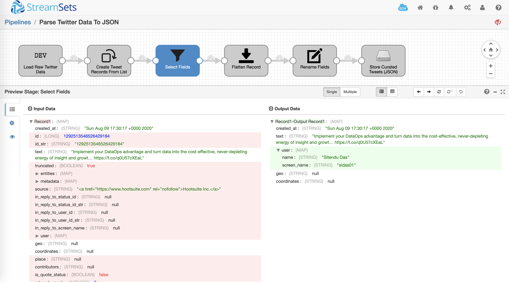
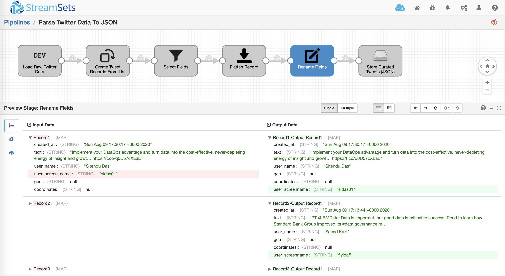
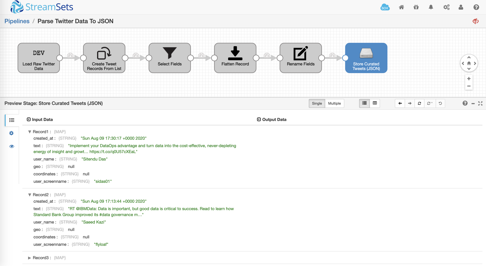

Parse Twitter Data To JSON
==========================

This pipeline demonstrates how to parse raw Twitter data and store curated data in JSON format.

Setup And Technical Details
---------------------------

* Download the [pipeline](ParseTwit08ef5e13-c53c-4664-8acf-4b393ec7782f.json) and import it into your Data Collector
* Update the following pipeline parameters
    * OUTPUT_FOLDER
        * This is the path to the folder where you'd like JSON file to be created
    * OUTPUT_FILE_PREFIX
        * This is the prefix you'd like to add to the JSON output file

Pipeline Overview
-----------------

The pipeline has been prepopulated with sample Twitter data using Dev Raw Data Source origin so you don't have to worry about loading it using HTTP Client origin.

Note that Twitter's API returns tweets in a nested structure within ***statuses*** list.

Pipeline Preview
----------------

Once you have updated the pipeline parameters, click on **Preview** icon to see how the data is being transformed as it is flowing through various stages in the pipeline. For details on data preview, refer to the [documentation](https://streamsets.com/documentation/datacollector/latest/help/datacollector/UserGuide/Data_Preview/DataPreview_Title.html#concept_jjk_23z_sq).

**Field Pivoter**

Using [Field Pivoter](https://streamsets.com/documentation/datacollector/latest/help/datacollector/UserGuide/Processors/ListPivoter.html#concept_ekg_313_qw) a tweet record is created for each nested item within *statuses* column. The configuration attribute of interest here is **Field To Pivot** set to ***/statuses*** on **Field To Pivot** tab.

**Field Remover**

Using [Field Remover](https://streamsets.com/documentation/datacollector/latest/help/datacollector/UserGuide/Processors/FieldRemover.html#concept_jdd_blr_wq) only a set of columns have been selected that will be part of the output record.

**Field Flattener**

Using [Field Flattener](https://streamsets.com/documentation/datacollector/latest/help/datacollector/UserGuide/Processors/FieldFlattener.html#concept_njn_3kk_fx) the nested structure for *user* map field is flattened. The configuration attribute of interest here is **Name separator** set to ***_*** on **Flatten** tab.

**Field Renamer**

Using [Field Renamer](https://streamsets.com/documentation/datacollector/latest/help/datacollector/UserGuide/Processors/FieldRenamer.html#concept_vyv_zsg_ht) the column *user_screen_name* is renamed to *user_screenname*.

**Local FS**

The curated Twitter data is stored in the local filesystem using [Local FS](https://streamsets.com/documentation/datacollector/latest/help/datacollector/UserGuide/Destinations/LocalFS.html#concept_zvc_bv5_1r) destination in JSON format. The configuration attribute of interest here is **Data Format** set to ***JSON*** on **Data Format** tab.

Pipeline Run
------------

Provided you've updated the pipeline parameters and there aren't any validation errors, running the pipleline should create one JSON output file.

**JSON** -- [Sample output file](output/tweets-curated-6a29b1bb-da8e-11ea-8b72-417388e3a72a_335bc746-b9c2-4ef0-a5ef-5a049d35985d.json).
