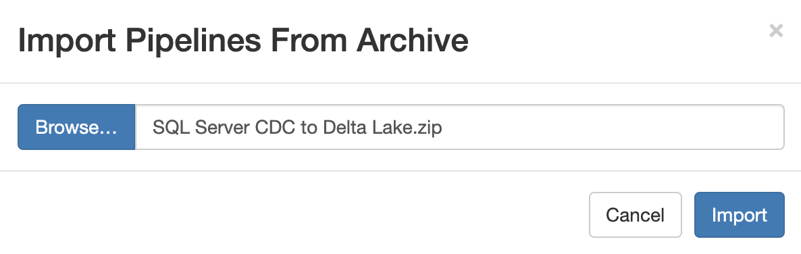

<h1>
SQL Server CDC to Databricks Delta Lake
</h1>

# SQL Server CDC to Databricks Delta Lake

**Important:** *These instructions assume you have access to StreamSets Data Collector (v3.15+) and have performed all the prerequisites for SQL Server and Databricks Delta Lake*

- For help installing [StreamSets Data Collector](https://streamsets.com/products/dataops-platform/data-collector/), see [StreamSets Data Collector Installation](https://streamsets.com/documentation/datacollector/latest/help/datacollector/UserGuide/Installation/Install_title.html).
- Your SQL Server database is enabled for Change Data Capture (CDC). For help with enabling CDC, see [About CDC - SQL Server](https://docs.microsoft.com/en-us/sql/relational-databases/track-changes/about-change-data-capture-sql-server?view=sql-server-ver15).
- For help with Databricks Delta Lake, see [Delta Lake Prerequisites](https://streamsets.com/documentation/datacollector/latest/help/index.html?contextID=concept_xnp_y5f_dlb).

## OVERVIEW

This pipeline demonstrates how to read change data capture (CDC) data from a SQL Server database and replicate the changes to Databricks Delta Lake. The pipeline assumes the following:
* SQL Server database is enabled for Change Data Capture.
* All tables in the database will be tracked for ingesting changes (Inserts, Updates and Deletes). If you need to track only certain tables, configure the [Capture Instance Name](https://streamsets.com/documentation/datacollector/latest/help/index.html?contextID=concept_sx3_d11_s1b) accordingly in the origin.
* Each source table will be mapped to it's corresponding table in Delta Lake. If the table doesn't exist in Delta Lake, it will be auto-created.
* The SQL Server CDC client generates records for multiple transaction types. The transaction type is captured in the record header as an attribute called [sdc.operation.type](https://streamsets.com/documentation/datacollector/latest/help/index.html?contextID=concept_yqg_sts_r1b):
  * 1 for Insert
  * 2 for Delete
  * 3 for Update, including updates captured after the update operation
  * 5 for unsupported operations, including updates captured before the update operation.
   The Databricks Delta Lake destination handles all but one operation type, which is sdc.operation.type=5. The Stream Selector processor in the pipeline routes and discards all records with sdc.operation.type=5.

**Disclaimer:** *This pipeline is meant to serve as a template for performing SQL Server CDC to Databricks Delta Lake.  Some of the parameters, tables and fields may be different for your environment and may need additional customizations.  Please consult the StreamSets documentation for full information on configuration of each stage used below.*

## PIPELINE

## DOCUMENTATION

[SQL Server CDC Origin](https://streamsets.com/documentation/datacollector/latest/help//datacollector/UserGuide/Origins/SQLServerCDC.html)

[Stream Selector Processor](https://streamsets.com/documentation/datacollector/latest/help/datacollector/UserGuide/Processors/StreamSelector.html)

[Databricks Delta Lake Destination](https://streamsets.com/documentation/datacollector/latest/help/datacollector/UserGuide/Destinations/DeltaLake.html)

## STEP-BY-STEP

### Step 1: Download the pipeline

[Click Here](./SQL_Server_CDC_to_DeltaLake.zip?raw=true) to download the pipeline and save it to your drive.

### Step 2: Import the pipeline

Click the down arrow next to the "Create New Pipeline" and select "Import Pipeline from archive".

Click "Browse" and locate the pipeline file you just downloaded, then click "Import"

### Step 3: Configure the parameters

Click on the pipeline you just imported to open it and click on the "Parameters" tab and fill in the appropriate information for your environment.

**Important:** *The pipeline template uses the most common default settings for things like the Delta Lake staging location, etc. All of these are configurable and if you need to change those, you can opt to not use the built-in parameters and choose the appropriate settings yourself. Please refer to the documentation listed in this document for all the available options.*

The following parameters are set up for this pipeline:

<table>
  <tr>
   <td><code>sqlserver_jdbc_url</code>
   </td>
   <td class="entry cellrowborder" headers="d436212e756 ">JDBC URL to connect to the SQL Server database.</td>
  </tr>
  <tr>
   <td><code>sqlserver_username</code>
   </td>
   <td class="entry cellrowborder" headers="d436212e853 ">SQL Server username.
</td>
  </tr>
  <tr>
   <td><code>sqlserver_password</code>
   </td>
    <td class="entry cellrowborder" headers="d436212e853 ">SQL Server password. Tip: To secure sensitive information such as user tokens and passwords, you can use <a class="href" href="https://streamsets.com/documentation/datacollector/latest/help/datacollector/UserGuide/Pipeline_Configuration/RuntimeValues.html">runtime resources</a> or <a class="href" href="https://streamsets.com/documentation/datacollector/latest/help/datacollector/UserGuide/Configuration/CredentialStores.html">credential stores.</a>

  </tr>
  <tr>
   <td><code>databricks_jdbc_url</code>
   </td>
   <td class="entry cellrowborder" headers="d198512e2230 ">JDBC URL used to connect to the Databricks cluster</td>
  </tr>
  <tr>
   <td><code>databricks_token</code>
   </td>
   <td class="entry cellrowborder" headers="d198512e2230 ">Personal access token used to connect to the Databricks cluster</td>
  </tr>
  <tr>
   <td><code>deltalake_database</code>
   </td>
   <td class="entry cellrowborder" headers="d198512e2230 ">Databricks database name for all tables</td>
  </tr>
  <tr>
   <td><code>deltalake_s3_bucket</code>
   </td>
   <td class="entry cellrowborder" headers="d198512e2372 ">S3 bucket for staging data before invoking COPY/MERGE command.</td>
  </tr>
  <tr>
   <td><code>s3_access_key</code>
   </td>
   <td class="entry cellrowborder" headers="d198512e2372 ">AWS access key. Leave empty if you enable IAM Roles</td>
  </tr>
  <tr>
   <td><code>s3_secret_key</code>
   </td>
   <td class="entry cellrowborder" headers="d198512e2372 ">AWS secret key. Leave empty if you enable IAM Roles</td>
  </tr>
</table>

### Step 4: Configure Key Columns in Delta Lake destination

Configure each table's Key Column in the Delta Lake destination. For CDC data, the MERGE command is applied on Delta Lake requiring columns for matching each table. See details [here](https://streamsets.com/documentation/datacollector/latest/help/datacollector/UserGuide/Destinations/DeltaLake.html)

### Step 5: Run the pipeline

Click the "START" button to run the pipeline.

### Step 6: Make changes to the SQL Server source tables and see the pipeline process them

