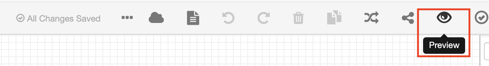
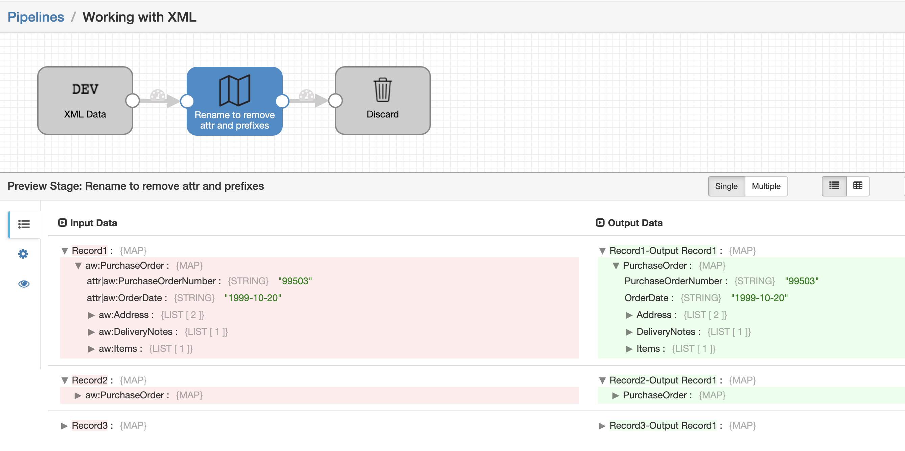

<h1>
Working with XML (Basic)
</h1>

**Important:** *These instructions assume you have access to StreamSets Data Collector (v3.16+) and have performed all the prerequisites*

- For help installing [StreamSets Data Collector](https://streamsets.com/products/dataops-platform/data-collector/), see [StreamSets Data Collector Installation](https://streamsets.com/documentation/datacollector/latest/help/datacollector/UserGuide/Installation/Install_title.html).

## OVERVIEW

This pipeline demonstrates how to read and process XML data in Data Collector. XML is very common data format verticals like HealthCare and Finance that have to follow industry standard data formats which are typically in XML.
- This shows an example of an XML source that can be split into records at the source itself by specifying the delimiter.
- The Field Mapper processor is a ‘swiss army knife’. It allows operating on multiple fields by name, value or data type in any hierarchical structure with a single expression.
- The example shows the most common requirement for XML in SDC, i.e. removing ‘attr’ and the prefix value from all field names.

## PIPELINE

")

## DOCUMENTATION

[Field Mapper](https://streamsets.com/documentation/datacollector/latest/help/datacollector/UserGuide/Processors/FieldMapper.html)

## STEP-BY-STEP

### Step 1: Download the pipeline

[Click Here](./Working_with_XML.zip?raw=true) to download the pipeline and save it to your drive.

### Step 2: Import the pipeline

Click the down arrow next to the "Create New Pipeline" and select "Import Pipeline".

Click "Browse" and locate the pipeline file you just downloaded, then click "Import"

### Step 3: Preview the pipeline

Click on the pipeline you just imported to open it and select the Preview icon

Leave all default options in the preview configuration and click "Run Preview"

Play around with the [Field Mapper](https://streamsets.com/documentation/datacollector/latest/help/datacollector/UserGuide/Processors/FieldMapper.html) processor to see all the different data processing operations it can handle.