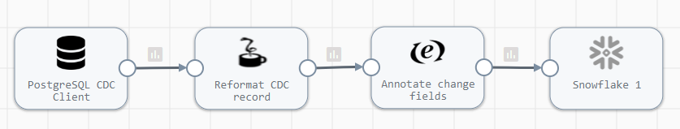
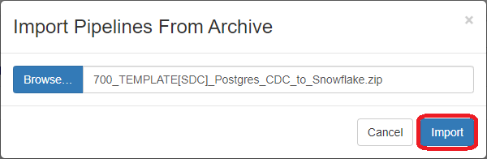

<h1>
PostgreSQL CDC to Snowflake
</h1>

# PostgreSQL CDC to Snowflake

**Important:** *These instructions assume you have access to StreamSets Data Collector (v3.15+) and have performed all the prerequisites for PostgreSQL and Snowflake*

- For help installing [StreamSets Data Collector](https://streamsets.com/products/dataops-platform/data-collector/), see [StreamSets Data Collector Installation](https://streamsets.com/documentation/datacollector/latest/help/datacollector/UserGuide/Installation/Install_title.html).
- For help with PostgreSQL CDC Client prerequisites, see [PostgreSQL CDC Client](https://streamsets.com/documentation/datacollector/latest/help/datacollector/UserGuide/Origins/PostgreSQL.html).
- For help with Snowflake prerequisites, see [Snowflake](https://streamsets.com/documentation/controlhub/latest/onpremhelp/datacollector/UserGuide/Destinations/Snowflake.html).

Here is a link to a short video on using this pipeline template: [Video Link](https://www.youtube.com/channel/UC_4K-__dngOCEmoZs7PVZAg)

## OVERVIEW

This pipeline demonstrates how to read change data capture (CDC) data from a PostgreSQL database and replicate the changes to Snowflake.

**Disclaimer:** *This pipeline is meant to serve as a template for performing PostgreSQL CDC to Snowflake.  Some of the parameters, tables and fields may be different for your environment and may need additional customizations.  Please consult the StreamSets documentation (linked below) for full information on configuration of each stage used below.*

## USING THE TEMPLATE

NOTE: [Templates](https://streamsets.com/documentation/controlhub/latest/onpremhelp/controlhub/UserGuide/Pipelines/PipelineTemplates.html) are supported in [StreamSets Control Hub](https://streamsets.com/products/dataops-platform/control-hub/). If you do not have Control Hub, you can import the template pipeline in Data Collector but will need to do that each time you want to use the template.

## PIPELINE

## DOCUMENTATION

[PostgreSQL CDC Client](https://streamsets.com/documentation/datacollector/latest/help/datacollector/UserGuide/Origins/PostgreSQL.html)

[Jython Evaluator](https://streamsets.com/documentation/controlhub/latest/help/datacollector/UserGuide/Processors/Jython.html)

[Expression Evaluator](https://streamsets.com/documentation/controlhub/latest/help/datacollector/UserGuide/Processors/Expression.html)

[Snowflake Destination](https://streamsets.com/documentation/controlhub/latest/help/datacollector/UserGuide/Destinations/Snowflake.html)

## STEP-BY-STEP

### Step 1: Download the pipeline

[Click Here](./PostgreSQL_CDC_to_Snowflake.zip?raw=true) to download the pipeline and save it to your drive.

### Step 2: Import the pipeline

Click the down arrow next to the "Create New Pipeline" and select "Import Pipeline From Archive".

Click "Browse" and locate the pipeline file you just downloaded, click "OK", then click "Import"

### Step 3: Configure the parameters

Click on the pipeline you just imported to open it and click on the "Parameters" tab and fill in the appropriate information for your environment.

**Important:** *The pipeline template uses the most common default settings for things like the Snowflake region, staging location, etc. All of these are configurable and if you need to change those, you can opt to not use the built-in parameters and choose the appropriate settings yourself. Please refer to the documentation listed in this document for all the available options.*

The following parameters are set up for this pipeline:

<table>
  <tr>
   <td><code>postgres_schema</code>
   </td>
   <td class="entry cellrowborder" style="text-align:left;" headers="d450352e828 ">Schema to use. You can enter a schema name or use a <a class="xref" href="../Apx-RegEx/RegEx-Title.html#concept_vd4_nsc_gs" title="A regular expression, also known as regex, describes a pattern for a string.">regular expression</a> to specify a set of
                                        schemas.</td>
  </tr>
  <tr>
   <td><code>postgres_tablename_pattern</code>
   </td>
   <td class="entry cellrowborder" style="text-align:left;" headers="d450352e828 ">A table name pattern that specifies the tables to track.
                                        You can enter a table name or use a <a class="xref" href="../Apx-RegEx/RegEx-Title.html#concept_vd4_nsc_gs" title="A regular expression, also known as regex, describes a pattern for a string.">regular expression</a> to specify a set of
                                        tables.</td>
  </tr>
  <tr>
   <td><code>postgres_jdbc_conn_string</code>
   </td>
   <td class="entry cellrowborder" headers="d450352e1093 ">
                                        
Connection string to use to connect to the database. Use
                                            the following syntax:

                                        

                                            <pre class="pre codeblock"><code>jdbc:postgresql://&lt;host&gt;:&lt;port&gt;/&lt;dbname&gt;</code></pre>
                                            
Note: If you include the JDBC credentials in the
                                                connection string, use the user account created for
                                                the origin. That user must have the superuser or
                                                replication role.

                                        

                                    </td>
  </tr>
  <tr>
   <td><code>postgres_username</code>
   </td>
   <td class="entry cellrowborder" headers="d450352e1195 ">User name for the
                                            JDBC connection.
The specified user must have the superuser or
                                            replication role.

</td>
  </tr>
  <tr>
   <td><code>postgres_password</code>
   <td class="entry cellrowborder" headers="d450352e1195 ">Password for the JDBC account.
Tip: To
                        secure sensitive information such as user names and passwords, you can use
                              <a class="xref" href="../Pipeline_Configuration/RuntimeValues.html#concept_bs4_5nm_2s" title="Similar to runtime properties, runtime resources are values that you define in a file local to the Data Collector and call from within a pipeline. But with runtime resources, you can restrict the permissions for the files to secure information.">runtime resources</a> or <a class="xref" href="../Configuration/CredentialStores.html#concept_bt1_bpj_r1b">credential stores.</a>

</td>
  </tr>
  <tr>
   <td><code>snowflake_account</code>
   </td>
   <td class="entry cellrowborder" headers="d198512e2230 ">Snowflake account name.</td>
  </tr>
  <tr>
   <td><code>snowflake_user</code>
   </td>
   <td class="entry cellrowborder" headers="d198512e2230 ">Snowflake user name.</td>
  </tr>
  <tr>
   <td><code>snowflake_password</code>
   </td>
   <td class="entry cellrowborder" headers="d198512e2230 ">Snowflake password.</td>
  </tr>
  <tr>
   <td><code>snowflake_warehouse</code>
   </td>
   <td class="entry cellrowborder" headers="d198512e2372 ">Snowflake warehouse.</td>
  </tr>
  <tr>
   <td><code>snowflake_database</code>
   </td>
   <td class="entry cellrowborder" headers="d198512e2372 ">Snowflake database.</td>
  </tr>
  <tr>
   <td><code>snowflake_schema</code>
   </td>
   <td class="entry cellrowborder" headers="d198512e2372 ">Snowflake schema.</td>
  </tr>
  <tr>
   <td><code>snowflake_stage_name</code>
   </td>
   <td class="entry cellrowborder" headers="d198512e2713 ">Name of the Snowflake stage used to stage the data.
                                            
Unless using a Snowflake internal user stage, you
                                            create this stage as part of the <a class="xref">Snowflake prerequisite tasks</a>.

To use a
                                            Snowflake internal user stage, enter a tilde
                                                (<code class="ph codeph">~</code>).

</td>
  </tr>
</table>

### Step 4: Run the pipeline

Click the "START" button to run the pipeline.

### Step 5: Make changes to the PostgreSQL source table and see the pipeline process them

