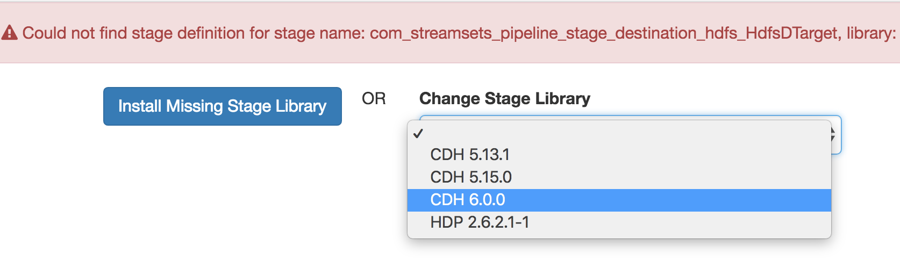

Drift Synchronization for Hive
==============================

This pipeline implements Drift Synchronization from MySQL to Apache Hive. It's based on the [Ingesting Drifting Data into Hive and Impala](https://github.com/streamsets/tutorials/tree/master/tutorial-hivedrift) tutorial, extended to include a Hive Executor.

Prerequisites
-------------

* [StreamSets Data Collector](https://streamsets.com/opensource/) 3.0.0 or higher
* StreamSets Data Collector CDH Stage Library
* StreamSets Data Collector JDBC Stage Library
* [Cloudera Enterprise or CDH](https://www.cloudera.com/downloads.html) - the [CDH Quickstart VM](http://www.cloudera.com/content/support/en/downloads/quickstart_vms.html) is a good place to start if you do not already have a Cloudera deployment.
* [Impala JDBC Connector for Cloudera Enterprise](https://www.cloudera.com/downloads/connectors/impala/jdbc/2-6-4.html)
* [MySQL](https://www.mysql.com/)
* [MySQL Connector/J](https://dev.mysql.com/downloads/connector/j/) JDBC Driver

Ensure that you are using the correct stage library for your version of CDH. See the [documentation for instructions in installing Data Collector stage libraries](https://streamsets.com/documentation/datacollector/latest/help/datacollector/UserGuide/Installation/AddtionalStageLibs.html#concept_fb2_qmn_bz).

Ensure that you use the matching Connector/J for your MySQL server. We have seen issues using the version 8.0.x JDBC Driver with MySQL 5.x.

Instructions
------------

* Ensure you have installed all of the prerequisite components listed above.
* [Download the pipeline](pipeline.json) and import it into Data Collector or Control Hub.
* If you see a 'Could not find stage definition' error on one or more stages, ensure you have installed the required stage libraries, then click each affected stage and choose the appropriate stage library from the 'Change Stage Library' dropdown:
  
* Configure the pipeline parameters:
  * `JDBC_URI` - JDBC Connection String for MySQL, e.g. `jdbc:mysql://localhost:3306/shipping`
  
MORE TBD