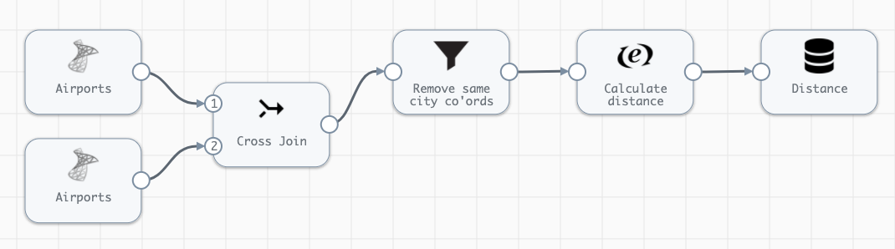
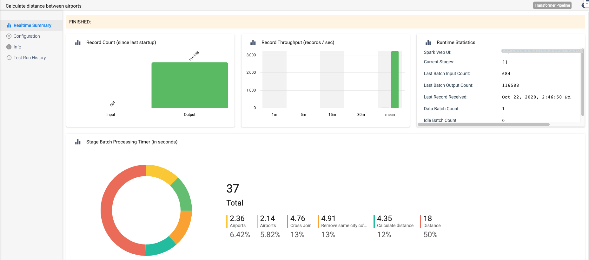
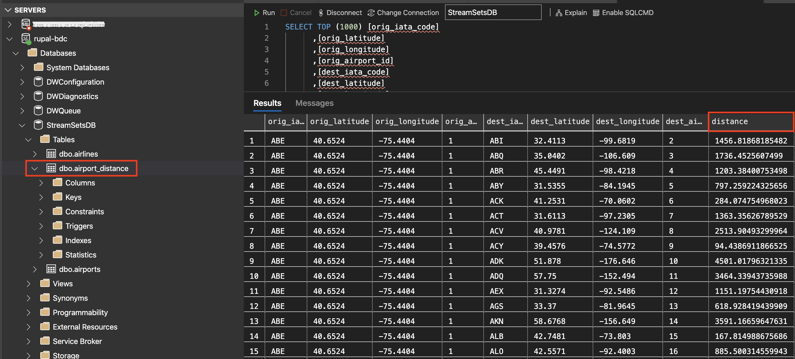

<h1>
Calculate Geographic Distance: UDF
</h1>

**Important:** *These instructions assume you have access to StreamSets Transformer*

- For help installing [StreamSets Transformer](https://streamsets.com/products/dataops-platform/transformer-etl/), see [StreamSets Transformer Installation](https://streamsets.com/documentation/transformer/latest/help/transformer/Installation/Installation-Title.html).

## OVERVIEW

This pipeline demonstrates how to create and register a User-Defined Function in Scala using [StreamSets Transformer](https://streamsets.com/products/dataops-platform/transformer-etl/). The UDF created in this example is a Haversine function that will return the geographic distance between 2 locations.

The source data for this pipeline is a table in SQL Server. Use this [SQL File](./airport.sql?raw=true "Airport Data") to create a copy of the table.

**Disclaimer:** *This pipeline is meant to serve as a template for creating, registering and using a User-Defined Function in Scala*

## PIPELINE

## STEP-BY-STEP

### Step 1: Download the pipeline

[Click Here](./Calculate_distance_between_airports.zip?raw=true) to download the pipeline and save it to your drive.

### Step 2: Import the pipeline

Click the down arrow next to the "Create New Pipeline" and select "Import Pipeline From Archive".

Click "Browse" and locate the pipeline file you just downloaded, click "OK", then click "Import"

### Step 3: Configure the parameters

Click on the pipeline you just imported to open it and click on the "Parameters" tab and fill in the appropriate information for your environment.

#### Note: The User-Defined function is created under Pipeline -> Advanced tab. You'll see how the function is defined and registered.

### Step 4: Run the pipeline

Click the "START" button to run the pipeline.

The pipeline will automatically complete and you'll notice a new table created in your database with the output results.

