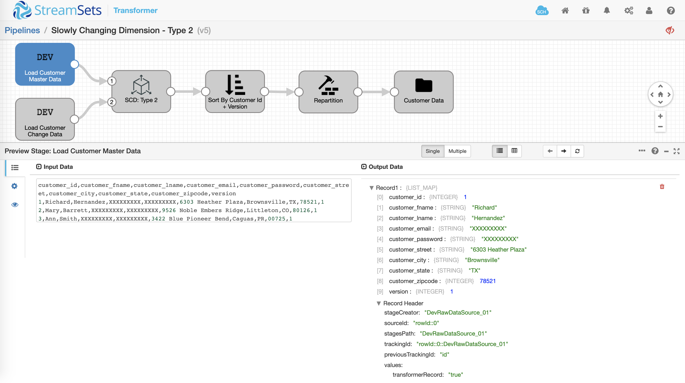
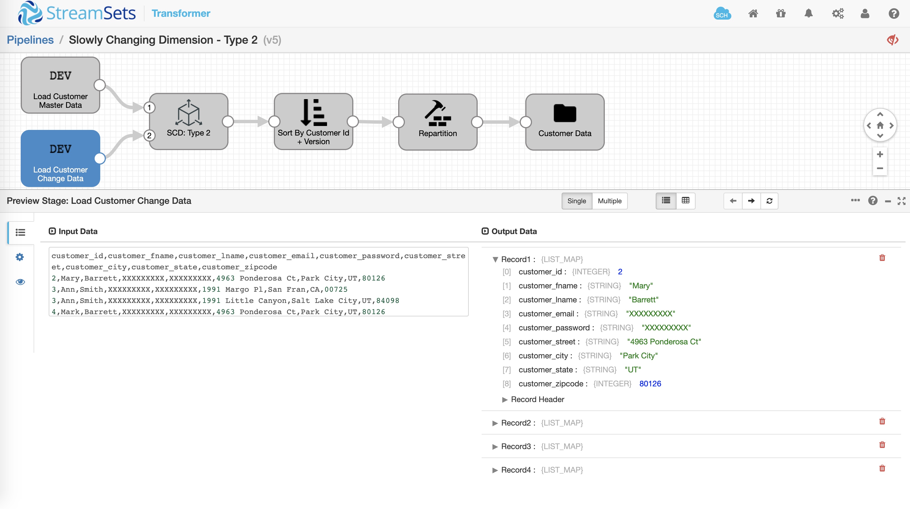
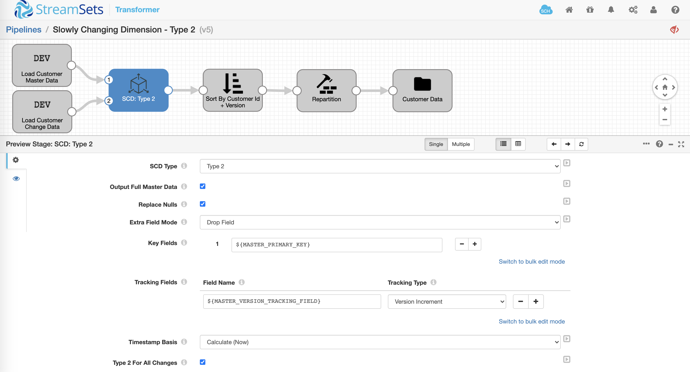
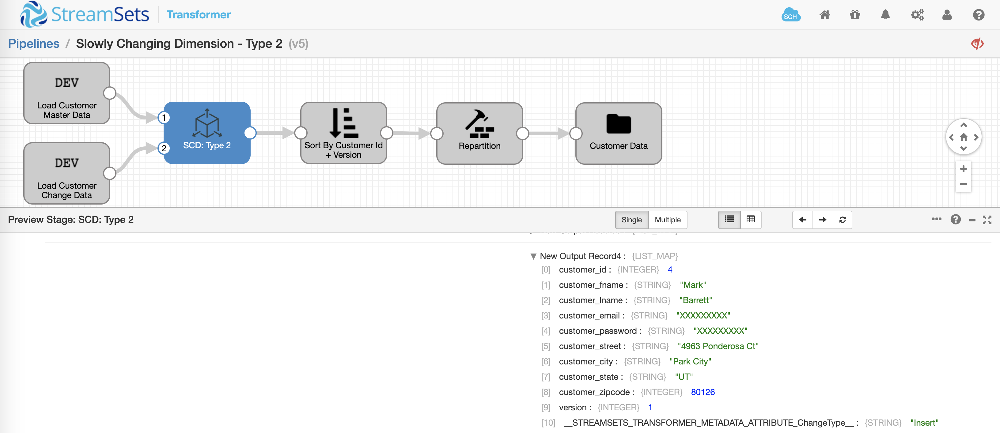
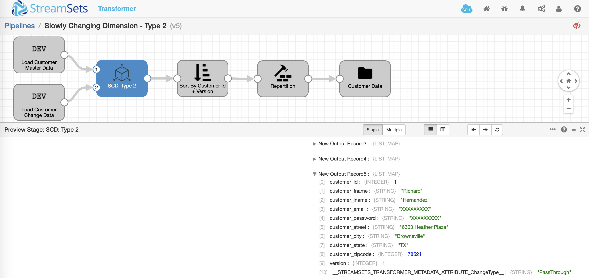
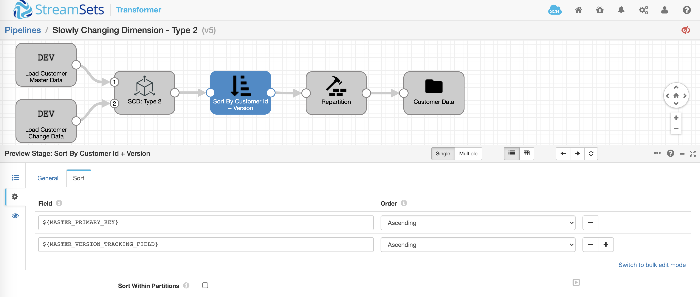
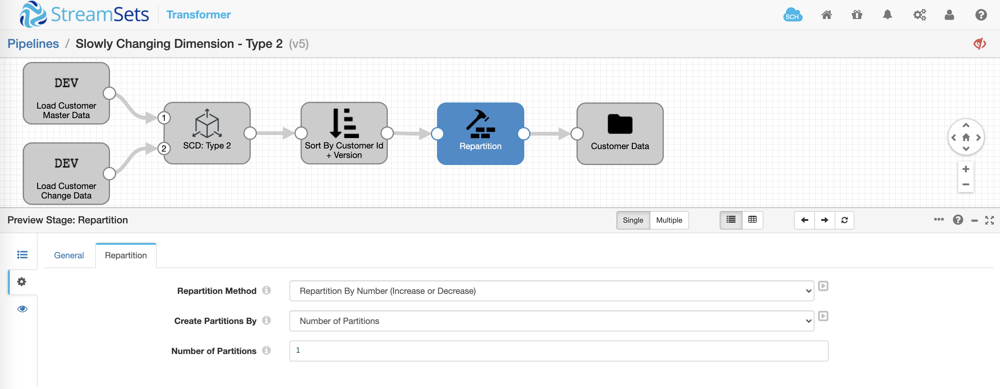
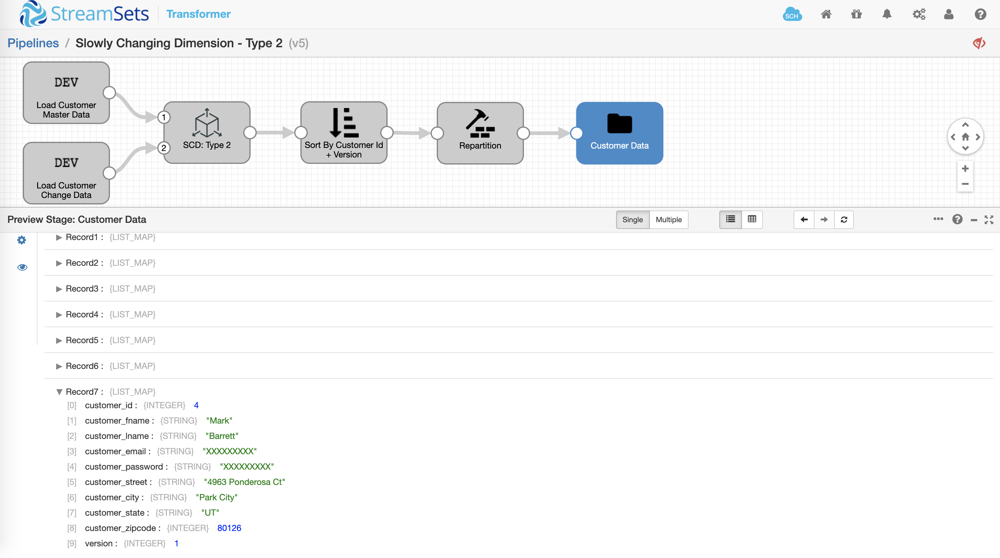

Slowly Changing Dimensions - Type 2
===================================

This pipeline demonstrates how to handle Slowly Changing Dimension - Type 2 operations.

Setup And Technical Details
---------------------------

* Download the [pipeline](SCDType2588a6d29-c8b9-439e-8bec-8b1f7b9c0e99.json) and import it into your Data Collector
* Update the following pipeline parameters
    * OUTPUT_FILE_FOLDER
        * This is the path to the folder where you'd like output file to be created
    * MASTER_PRIMARY_KEY
        * This is the primary key of the dimension table. **Note**: If using the prepopulated customer data "as-is", leave the default value of *customer_id*
    * MASTER_VERSION_TRACKING_FIELD
        * This is the tracking field of the dimension table. **Note**: If using the prepopulated customer data "as-is", leave the default value of *version*


Pipeline Overview
-----------------

Let’s take a very simple yet concrete example of managing customer records (with updates to addresses) for existing and new customers. In this case, the assumption is that the destination is empty so it’s a one-time migration scenario for ingesting "master" and "change" records from respective origins to a new file destination.

The pipeline has been prepopulated with sample customers "master" and "change" data using Dev Raw Data Source origins so you don't have to worry about loading it.

"Master" data



```
customer_id,customer_fname,customer_lname,customer_email,customer_password,customer_street,customer_city,customer_state,customer_zipcode,version
1,Richard,Hernandez,XXXXXXXXX,XXXXXXXXX,6303 Heather Plaza,Brownsville,TX,78521,1
2,Mary,Barrett,XXXXXXXXX,XXXXXXXXX,9526 Noble Embers Ridge,Littleton,CO,80126,1
3,Ann,Smith,XXXXXXXXX,XXXXXXXXX,3422 Blue Pioneer Bend,Caguas,PR,00725,1
```

"Change" data



```
customer_id,customer_fname,customer_lname,customer_email,customer_password,customer_street,customer_city,customer_state,customer_zipcode
2,Mary,Barrett,XXXXXXXXX,XXXXXXXXX,4963 Ponderosa Ct,Park City,UT,80126
3,Ann,Smith,XXXXXXXXX,XXXXXXXXX,1991 Margo Pl,San Fran,CA,00725
3,Ann,Smith,XXXXXXXXX,XXXXXXXXX,1991 Little Canyon,Salt Lake City,UT,84098
4,Mark,Barrett,XXXXXXXXX,XXXXXXXXX,4963 Ponderosa Ct,Park City,UT,80126
```

*Note*: The "change" data does **not** include *version* tracking field.


Pipeline Preview
----------------

Once you have updated the pipeline parameters, click on **Preview** icon to see how the data is being transformed as it is flowing through various stages in the pipeline.

**Slowly Changing Dimension (SCD)**



Using [Slowly Changing Dimension](https://streamsets.com/documentation/transformer/latest/help/transformer/Processors/SCDimension.html#concept_ixk_bbr_j3b) the pipeline is desgined to handle Slowly Changing Dimension - Type 2 operations.

The attributes of interest on **Dimension** tab are:

* **SCD Type**: Type 2
* **Output Full Master Data**: Enabled (So all the records from "master" origin will be included in the output.)
* **Key Fields**: *${MASTER_PRIMARY_KEY}* which is defaulted to *customer_id* for this particular dataset. It is used to join "master" and "change" data.
* **Tracking Fields**: *${MASTER_VERSION_TRACKING_FIELD}* which is defaulted to *version* for this particular dataset. The SCD processor will set the value for it.

Given the datasets and above configuration, all of the "change" data records will have *__STREAMSETS_TRANSFORMER_METADATA_ATTRIBUTE_ChangeType__* set to "Insert". 


*Note*: The SCD processor sets *version* column to 1 where *customer_id* doesn’t exist in "master" dataset. Otherwise it will be incremented.



Given the datasets and above configuration, all of the "master" data records will have *__STREAMSETS_TRANSFORMER_METADATA_ATTRIBUTE_ChangeType__* set to "PassThrough".



 *Note*: If **Output Full Master Data** was not enabled, these records would **not** be included in the output.


**Sort**



Using [Sort](https://streamsets.com/documentation/transformer/latest/help/transformer/Processors/Sort.html#concept_jw2_pq5_rgb) the records are sorted by *${MASTER_PRIMARY_KEY}* and *${MASTER_VERSION_TRACKING_FIELD}* so in this case the output records will ordered by *customer_id* and *version*. *Note*: This stage is optional and depends on your use case.


**Repartition**



Using [Repartition](https://streamsets.com/documentation/transformer/latest/help/transformer/Processors/Repartition.html#concept_cm5_lfg_wgb) will force the pipeline to generate output in a single file. *Note*: This stage is optional and depends on your use case.


**Output**



Given the two datasets above the resulting output will look like this. Notice that the total number of output records is **7**; **3** records from "master" origin for existing customers and **4** records from the "change" origin–-where **3** records are for existing customers (1 for Mary and 2 for Ann) with their updated address and version incremented, and one record for new customer Mark with version set to 1.

```
customer_id,customer_fname,customer_lname,customer_email,customer_password,customer_street,customer_city,customer_state,customer_zipcode,version
1,Richard,Hernandez,XXXXXXXXX,XXXXXXXXX,6303 Heather Plaza,Brownsville,TX,78521,1
2,Mary,Barrett,XXXXXXXXX,XXXXXXXXX,9526 Noble Embers Ridge,Littleton,CO,80126,1
2,Mary,Barrett,XXXXXXXXX,XXXXXXXXX,4963 Ponderosa Ct,Park City,UT,80126,2
3,Ann,Smith,XXXXXXXXX,XXXXXXXXX,3422 Blue Pioneer Bend,Caguas,PR,725,1
3,Ann,Smith,XXXXXXXXX,XXXXXXXXX,1991 Margo Pl,San Fran,CA,725,2
3,Ann,Smith,XXXXXXXXX,XXXXXXXXX,1991 Little Canyon,Salt Lake City,UT,84098,3
4,Mark,Barrett,XXXXXXXXX,XXXXXXXXX,4963 Ponderosa Ct,Park City,UT,80126,1
```


Pipeline Run
------------

Provided you've updated the pipeline parameters and there aren't any validation errors, running the pipleline should create one output file in CSV format.

**CSV** -- [Sample output file](output/part-00000-d21cc8cc-75b9-4e69-aa56-55e5abe93bac-c000.csv).


Design Patterns
---------------

To learn more about a few design patterns for Slowly Changing Dimensions - Type 2, [read this blog](https://streamsets.com/blog/streamsets-transformer-design-patterns-for-slowly-changing-dimensions/).
