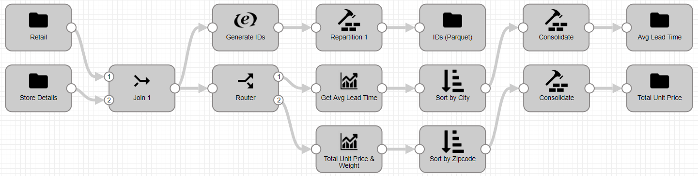
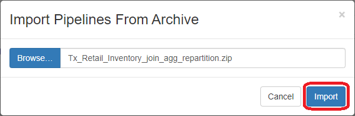
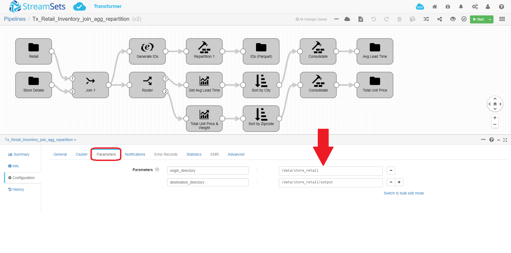
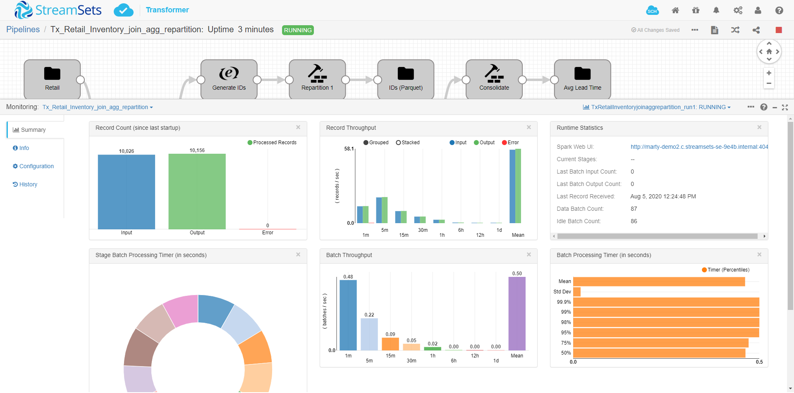

<h1><p align="center">Tx Retail Inventory - Join Agg Repartition</p></h1>

# Tx Retail Inventory - Join Agg Repartition

**Important:** *These instructions assume you have access to StreamSets Transformer*

- For help installing [StreamSets Transformer](https://streamsets.com/products/dataops-platform/transformer-etl/), see [StreamSets Transformer Installation](https://streamsets.com/documentation/transformer/latest/help/transformer/Installation/Installation-Title.html).

Here is a link to a short video on using this pipeline template: [Video Link](https://www.youtube.com/channel/UC_4K-__dngOCEmoZs7PVZAg)

## OVERVIEW

This pipeline demonstrates how to use [StreamSets Transformer](https://streamsets.com/products/dataops-platform/transformer-etl/) to perform a Join, Aggregations and Repartitions.

The source data for this pipeline is attached to this folder and requires you to download them and put them in a folder on your Transformer instance.  This pipeline writes data to a file on the local file system.  You could change the origins and destination to any supported types, but you would need to configure those manually.  This pipeline uses the built-in spark node for demonstration only.  You would want to execute this on your spark cluster. See [this link](https://streamsets.com/documentation/transformer/latest/help/transformer/Clusters/Clusters-Title.html) for more information.

**Disclaimer:** *This pipeline is meant to serve as a template for using Joins, Aggregations and Repartitions.*

## USING THE TEMPLATE

NOTE: [Templates](https://streamsets.com/documentation/controlhub/latest/help/controlhub/UserGuide/Pipelines/PipelineTemplates.html) are supported in [StreamSets Control Hub](https://streamsets.com/products/dataops-platform/control-hub/). If you do not have Control Hub, you can import the template pipeline in Data Collector but will need to do that each time you want to use the template.

## PIPELINE



### Pipeline Description with links to documentation

Stage | Description
--- | ---
[Retail and Store Details](https://streamsets.com/documentation/transformer/latest/help/transformer/Origins/File.html?contextID=concept_jcx_f2d_qgb) | Reads the source data from files on the local file system
[Slowly Changing Dimension](https://streamsets.com/documentation/transformer/latest/help/transformer/Processors/SCDimension.html?contextID=concept_ixk_bbr_j3b) | Generates updates to a Type 1 or Type 2 slowly changing dimension by evaluating change data against master dimension data
[Consolidate to 1 file](https://streamsets.com/documentation/transformer/latest/help/transformer/Processors/Repartition.html?contextID=concept_cm5_lfg_wgb) | Repartition - change the number of partitions that are written to file systems to 1
[Master](https://streamsets.com/documentation/transformer/latest/help/transformer/Destinations/File-D.html?contextID=concept_akw_2r3_xgb) | Writes data to a local file system

## PREREQUISITES

You need to download the source files from links below and put these on your Transformer machine.  By default, the pipeline uses ```/data/store_retail``` as the source directory.  This can be changed with the parameters below.  Please create the source directories with proper permissions for the Transformer user to read/write files.  The destination directories will be created automatically but please ensure the user has permissions to create and write to those directories.

## STEP-BY-STEP

### Step 1: Download the source data

[Click Here](./Data.zip?raw=true) to download the source data

* Move the file (Data.zip) to the Transformer machine (using SCP/FTP, etc...)
* On the Transformer machine, create the directories for the source files
  * ```mkdir -p /data/store_retail```
* Ensure proper permissions are set
  * ```chmod 777 /data/store_retail```
* Unzip Data.zip to the directory created above
  * ```unzip -d /data/store_retail Data.zip```

### Step 2: Download the pipeline

[Click Here](./Tx_Retail_Inventory_join_agg_repartition.zip?raw=true) to download the pipeline and save it to your drive.

### Step 3: Import the pipeline

Click the down arrow next to the "Create New Pipeline" and select "Import Pipeline From Archive".


Click "Browse" and locate the pipeline file you just downloaded, click "OK", then click "Import"



### Step 4: Configure the parameters

Click on the pipeline you just imported to open it and click on the "Parameters" tab and fill in the appropriate information for your environment.

**Important:** *For this pipeline, you only need to specify the input and output directories for the source and destination files.  This is on the local file system where Transformer is installed.*



The following parameters are set up for this pipeline:
<table>
  <tr>
  <td><code>origin_directory</code>
   </td>
   <td class="entry cellrowborder" headers="d31669e688 "><span class="ph" id="task_rcy_b4f_dhb__d67e2186">Path to the directory for
                                            the output files.</span>
                                        <p>Use the following
                                            format:</p>
<p class="p"><code class="ph codeph">/&lt;directory&gt;</code></p>
</td>
</tr>
   <td><code>destination_directory</code>
   </td>
   <td class="entry cellrowborder" headers="d31669e688 "><span class="ph" id="task_rcy_b4f_dhb__d67e2186">Path to the directory for
                                            the output files.</span>
                                        <p>Use the following
                                            format:</p>
<p class="p"><code class="ph codeph">/&lt;directory&gt;</code></p>
</td>
  </tr>
</table>

### Step 5: Run the pipeline

Click the "START" button to run the pipeline.


